# heihe / qhh：TSR 影响分析 + 全域水量平衡验证（Baseline vs TSR）

本文记录 `input/heihe` 与 `input/qhh` 两个流域在 **Baseline（TSR=OFF）** 与 **TSR=ON** 两套方案下的：

- **TSR 对辐射/ET/非饱和水（Unsat）/地下水（GW）** 的影响（含阴阳坡对比）
- **全域（basin-scale）水量平衡** 的验证结果（以出口断面 Q 为域外出流）

> 说明：本文仅做“全域水量平衡（basin）”与“阴阳坡分组响应”总结；逐 element 的精细平衡可在此基础上继续展开。

---

## 1. 数据与运行配置

### 1.1 运行目录

- heihe
  - Baseline：`output/heihe.base/`
  - TSR：`output/heihe.tsr/`
- qhh
  - Baseline：`output/qhh.base/`
  - TSR：`output/qhh.tsr/`

### 1.2 模拟时长（默认时长 vs forcing 覆盖）

- **heihe**
  - `input/heihe/forcing.csv` 的 forcing 时间覆盖到 `Time_Day=9495`（最后一行是 9495）。
  - `input/heihe/heihe.cfg.para` 默认 `END=9861`，超出 forcing 覆盖会导致运行中断。
  - 本次用于分析的两个 heihe 运行均使用 **可用 forcing 的最大覆盖长度**：`END=9495`（输出记录数 `9495`，逐日 `DT=1440 min`）。
- **qhh**
  - `input/qhh/qhh.cfg.para`：`START=1`，`END=3280`（输出记录数 `3279`，逐日 `DT=1440 min`）。

### 1.3 关键求解器参数（来自 cfg.para）

- heihe：`MAX_SOLVER_STEP=10 min`
- qhh：`MAX_SOLVER_STEP=6 min`

### 1.4 TSR 配置（本次 TSR=ON 运行）

- `TERRAIN_RADIATION=1`
- `TSR_FACTOR_MODE=FORCING_INTERVAL`（forcing 区间等效 TSR 因子；对逐日短波 forcing 尤其关键）
- `TSR_INTEGRATION_STEP_MIN=60`

---

## 2. 分组方法：阴坡/阳坡/平坦/其他

为便于解释 TSR 对“阴阳坡差异”的作用，按 element 的坡度与坡向做分组（与 `src/classes/Element.cpp` 的坡向定义保持一致）：

- 坡度阈值：`slope >= 5°` 才认为“有坡向意义”
- 南向（阳坡）：坡度满足阈值，且坡向在 `180° ± 45°`
- 北向（阴坡）：坡度满足阈值，且坡向在 `0° ± 45°`
- 平坦（flat）：`slope < 5°`
- 其他：满足坡度阈值但不在南/北向窗口内

### 2.1 分组面积占比（解释“flat 占比为什么这么大”）

> qhh 的地形整体较平缓（`slope<5°` 的面积占比很高），因此会看到 “flat 占比很大”——这并不是漏分组，而是阈值定义导致。

| Basin | N_ele | A_total (m²) | South area% | North area% | Flat area% | Other area% |
|---|---:|---:|---:|---:|---:|---:|
| heihe | 1779 | 10050221131.8 | 16.6% | 18.4% | 41.2% | 23.8% |
| qhh | 4773 | 29613685586.3 | 4.8% | 4.7% | 82.9% | 7.5% |

对应图（面积占比）：

- heihe：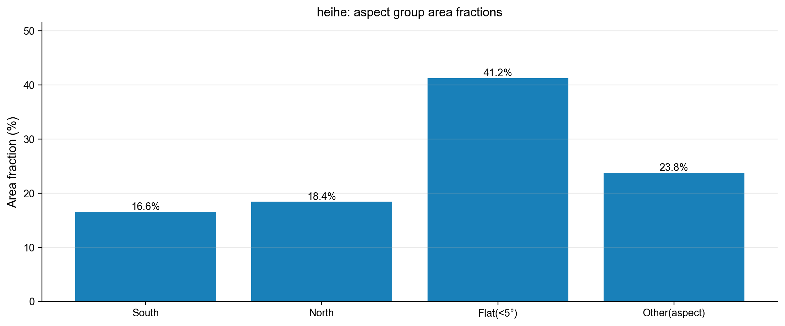
- qhh：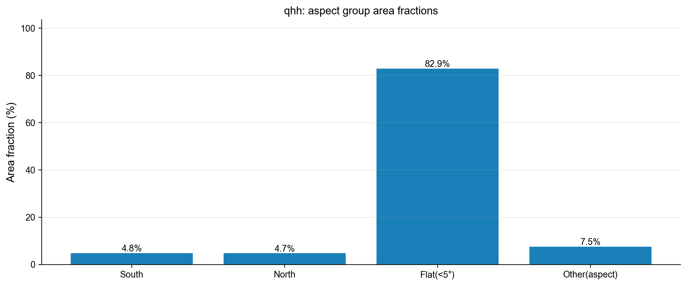

---

## 3. TSR 对辐射的影响（rn_factor / rn_h / rn_t）

### 3.1 使用的输出变量

- `*.rn_factor.dat`：TSR 的“地形辐射修正因子”（Baseline 为 1）
- `*.rn_h.dat`：水平面辐射项（本数据中空间上为常数，仅随时间变）
- `*.rn_t.dat`：地形修正后的辐射项（TSR 打开后随坡向/坡度变化）

### 3.2 rn_factor 的整体分布（TSR=ON，全时段×全格点）

| Basin | min | p50 | p95 | max |
|---|---:|---:|---:|---:|
| heihe | 0.121 | 0.994 | 1.197 | 1.794 |
| qhh | 0.187 | 0.601 | 0.680 | 1.192 |

> 重要说明（避免误读）：`*.rn_h.dat / *.rn_t.dat / *.rn_factor.dat` 都是由 SHUD 的输出控制器在每个 `DT_QE_ET` 区间内做**时间平均**后写出（`Print_Ctrl::PrintData()` 会对 buffer 做区间均值，见 `src/classes/Model_Control.cpp`）。
>
> - 输出的 `rn_factor` 实际上是区间平均 $\langle factor \rangle$（不是瞬时值）。
> - 输出的 `rn_t` 是 $\langle rn_h \cdot factor \rangle$，而输出的 `rn_h` 是 $\langle rn_h \rangle$。
> - 当 forcing 为子日尺度（如 qhh 的 3 小时辐射 forcing）且 `factor` 与 `rn_h` 强相关时，通常有 $\langle rn_h \cdot factor \rangle \ne \langle rn_h \rangle \cdot \langle factor \rangle$，因此不能仅凭 “`rn_factor < 1`” 就断言 “`rn_t < rn_h`”；这也是 qhh 中会出现 `rn_t/rn_h > 1` 的原因之一。
> - 对 heihe（forcing 逐日、`rn_h` 在日内近似常数）上述差异会显著减弱，因而 `rn_t ≈ rn_h · rn_factor` 更接近成立。

### 3.3 阴阳坡（South−North）辐射差异

时间平均的 **South−North** 差异（area-weighted time mean）：

- heihe：$\Delta rn_t$（South−North）≈ **+53.62 W/m²**（TSR=ON；Baseline≈0）
- qhh：$\Delta rn_t$（South−North）≈ **+37.38 W/m²**（TSR=ON；Baseline≈0）

对应时间序列图：

- heihe：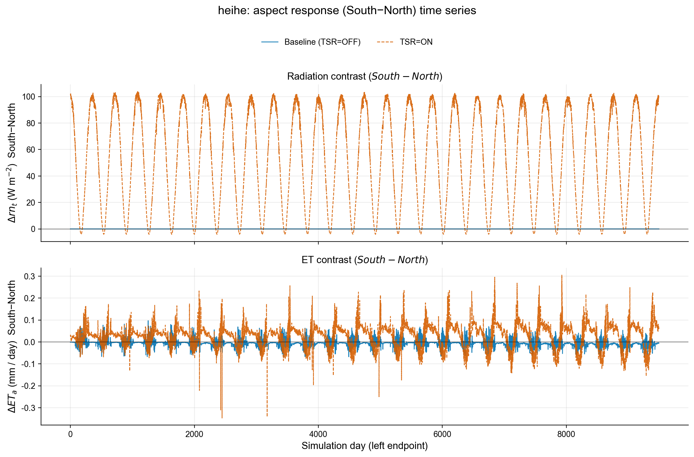
- qhh：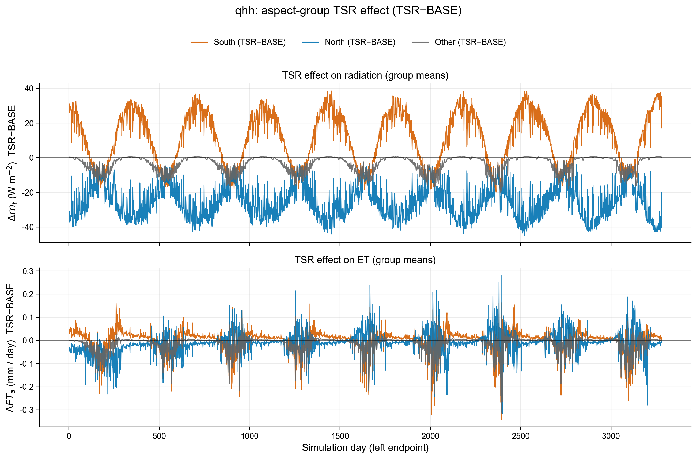

逐 element 的**累计辐射**相对“平面基准”（`rn_h`）的变化（全期积分；`rn_t` vs `rn_h`；单位 MJ/m² 与 %；色标为 `p99(|·|)` 对称截断）：

- heihe：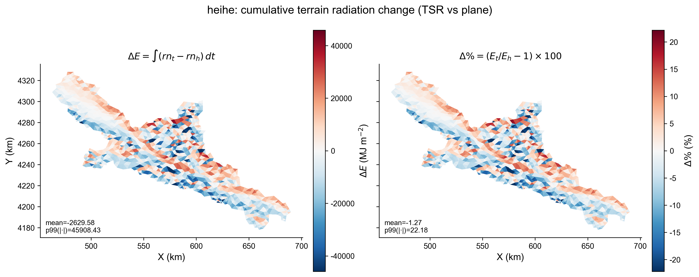
- qhh：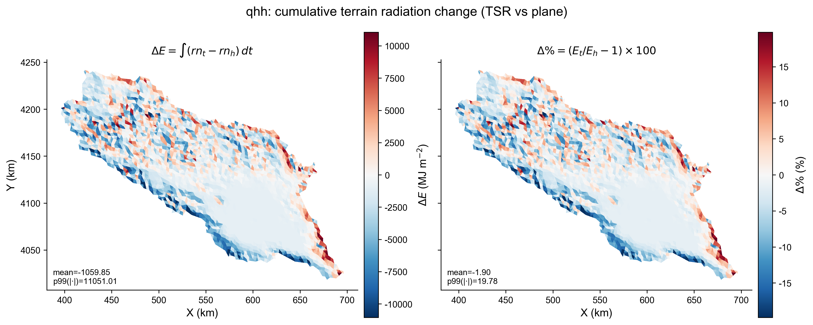

---

## 4. TSR 的水文响应：ET、Unsat、GW（含阴阳坡对比）

### 4.1 使用的输出变量

- `*.eleveta.dat`：实际蒸散发（按 `DT_QE_ET=1440` 输出；本文按“每输出间隔”解释并换算为 `mm/interval`）
- `*.eleyunsat.dat`：非饱和水状态量 `yUnsat`（m）
- `*.eleygw.dat`：地下水状态量 `yGW`（m）

### 4.2 全域量级变化（来自 basinwbfull 的积分统计）

> 下表来自 `*.basinwbfull.dat` 的整段累计量（单位换算为 **mm over mesh area**），用于解释 TSR 对“ET 减少 → 水去向（储量/出流）”的整体影响。

#### heihe（START=0，END=9495 day）

| Case | P (mm) | ET (mm) | Qout (mm) | $\Delta S_{total}$ (mm) | Resid (mm) |
|---|---:|---:|---:|---:|---:|
| Baseline | 8129.0 | 6074.8 | 59.3 | 1976.8 | -18.1 |
| TSR | 8129.0 | 6051.4 | 60.8 | 2000.4 | -16.5 |
| TSR − Baseline | 0.0 | **-23.5** | **+1.5** | **+23.6** | +1.6 |

对应图（整段累计的 P/ET/Qout/$\Delta S$/Residual 对比）：

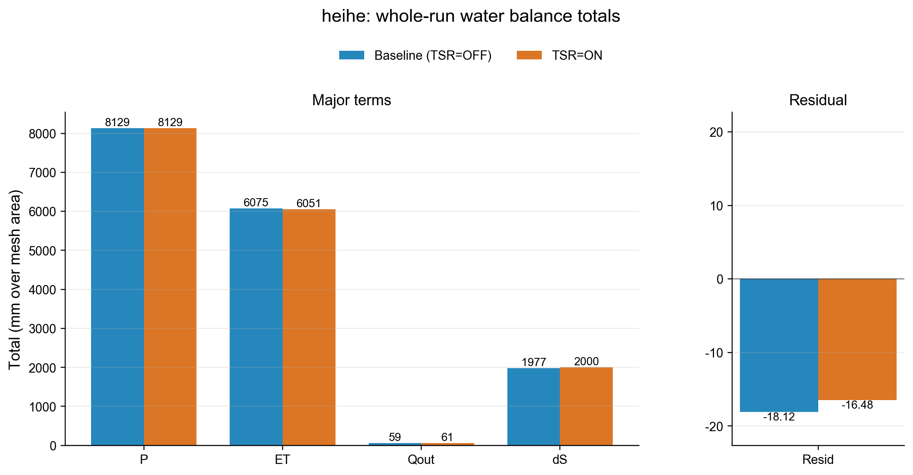

**解读（heihe）**

- 在采用 “forcing 区间等效” 的 TSR 因子语义后，heihe 的 TSR 全域响应变得温和：ET 仅下降约 **-23.5 mm**。
- 水量主要转化为 **储量增加**（$\Delta S_{total}$ 约 **+23.6 mm**）以及很小的 **出口出流增加**（Qout 约 **+1.5 mm**）。

#### qhh（START=1，END=3280 day）

| Case | P (mm) | ET (mm) | Qout (mm) | $\Delta S_{total}$ (mm) | Resid (mm) |
|---|---:|---:|---:|---:|---:|
| Baseline | 2523.1 | 2575.1 | 72.1 | -479.7 | -355.5 |
| TSR | 2523.1 | 2565.8 | 72.1 | -470.5 | -355.7 |
| TSR − Baseline | 0.0 | **-9.3** | ~0.0 | **+9.2** | ~0.0 |

对应图：

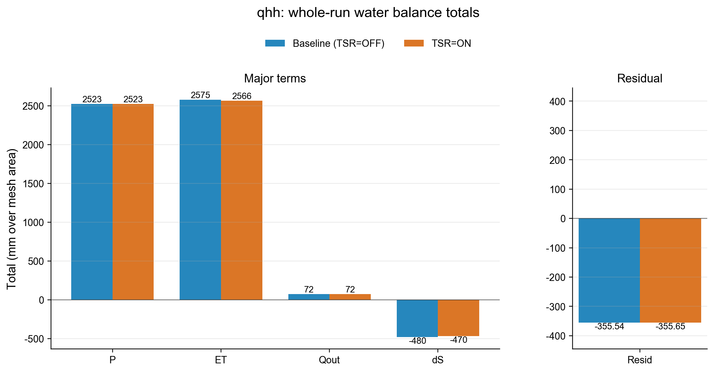

**解读（qhh）**

- qhh 的 TSR 响应在“全域量级”上很弱：ET 仅减少 ~9 mm，Qout 基本不变。
- 重要背景：qhh 的 **flat 面积占比约 82.9%**，南北向坡面占比很小（各约 5%），因此“阴阳坡辐射差异”不一定能转化为显著的全域水文差异。

### 4.3 阴阳坡（South−North）储量差异：Unsat / GW

时间平均的 **South−North** 差异（area-weighted time mean）：

| Basin | Variable | Baseline (S−N) | TSR (S−N) | TSR effect = TSR−Baseline |
|---|---|---:|---:|---:|
| heihe | yUnsat (m) | -0.02758 | -0.29597 | **-0.26839** |
| heihe | yGW (m) | -0.13815 | -0.17129 | **-0.03314** |
| qhh | yUnsat (m) | +0.10023 | +0.02567 | **-0.07455** |
| qhh | yGW (m) | +0.00628 | +0.00625 | ~0.0 |

对应时间序列图（含 TSR effect = $\Delta_{TSR} - \Delta_{BASE}$）：

- heihe：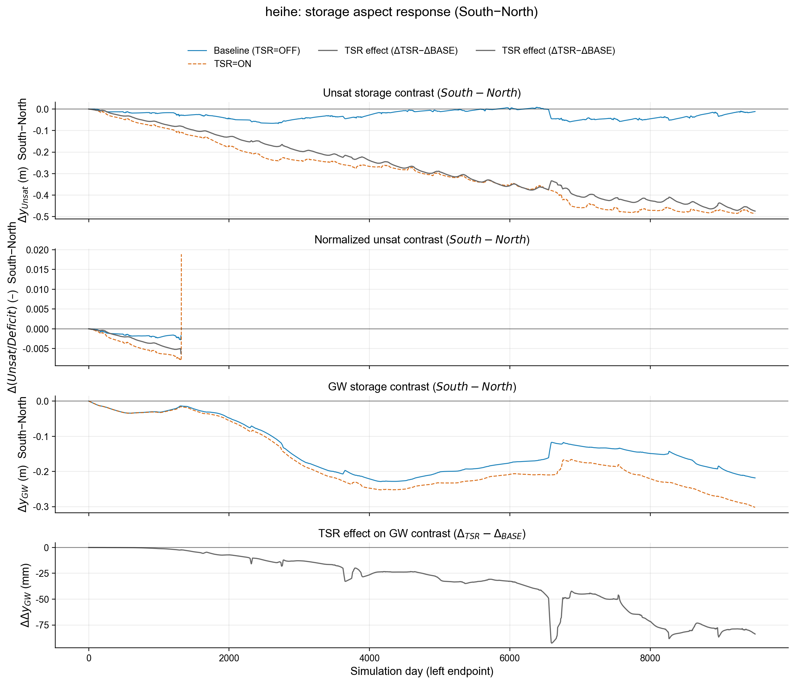
- qhh：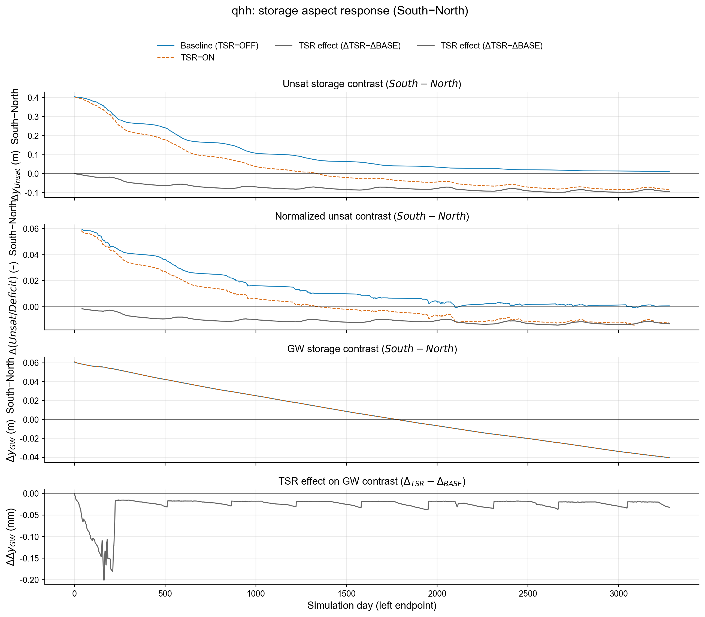

对应空间分布图（全期时间平均的 **TSR−BASE**；`yUnsat` 与 `yGW`，单位 mm；色标为 `p99(|·|)` 对称截断以提升可读性）：

- heihe：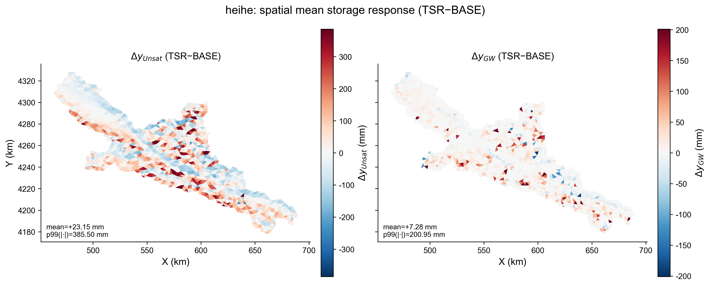
- qhh：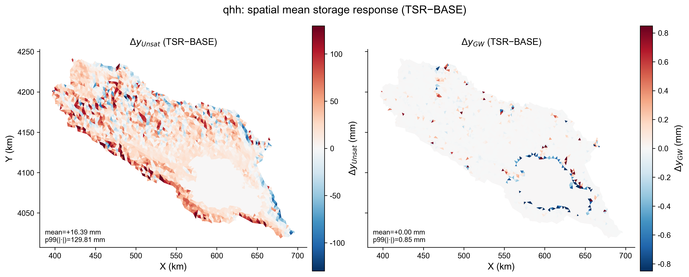

**解读（阴阳坡 Unsat/GW）**

- heihe：TSR 使 South−North 的差异更负（南坡相对更“干/少储量”，北坡相对更“湿/多储量”），符合“南坡受辐射更强 → ET 更强”的直觉方向。
- qhh：TSR 反而削弱了原有的 South−North Unsat 差异（从 +0.10 m 降到 +0.026 m），且 GW 差异几乎不变；结合 flat 占比很高，可理解为：坡面像元在全域中占比太小，且系统响应可能被其他控制因子（地形/水文连通性/下垫面参数）主导。

---

## 5. 全域水量平衡验证（basinwbfull）

### 5.1 诊断定义（输出：`*.basinwbfull.dat`）

`basinwbfull` 为全域累计积分诊断（单位 m³），每个输出间隔（此处 1 天）写一条记录：

- $\Delta S_{total} = \Delta(S_{ele\_full} + S_{riv})$
  - $S_{ele\_full} = \sum_i [ (ySurf + Sy \cdot yUnsat + Sy \cdot yGW + ySnow + yIS) \cdot area ]$
  - $S_{riv}$ 使用河道断面面积×河段长度累计（与 SHUD 河道几何一致）
- $P = \int \sum_i (qElePrep \cdot area) dt$
- $ET = \int \sum_i ((qEleE\_IC\_raw + qEs + qEu + qEg + qTu + qTg) \cdot area) dt$
- $Qout = \int (\sum outlets\ discharge) dt$
- $Residual = \Delta S_{total} - (P + Qbc + Qss - ET - Qout - Qedge)$

换算为 mm（便于量级对比）：

$$Residual_{mm} = \frac{Residual_{m^3}}{A_{mesh}} \times 1000$$

### 5.2 Residual 统计（mm / interval）

| Basin | Case | max\|resid\| | rms(resid) | p95\|resid\| | p99\|resid\| | Σ resid |
|---|---|---:|---:|---:|---:|---:|
| heihe | Baseline | 0.638 | 0.0343 | 0.0298 | 0.176 | -18.12 |
| heihe | TSR | 0.539 | 0.0335 | 0.0296 | 0.176 | -16.48 |
| qhh | Baseline | 2.816 | 0.2836 | 0.640 | 1.325 | -355.54 |
| qhh | TSR | 2.896 | 0.2837 | 0.630 | 1.331 | -355.65 |

对应时间序列图（Residual + 累计 Residual）：

- heihe：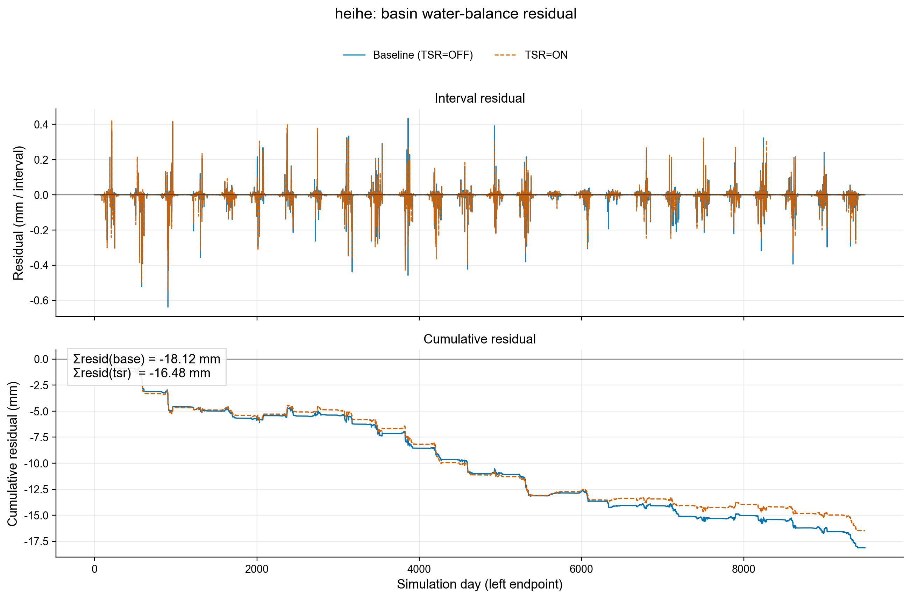
- qhh：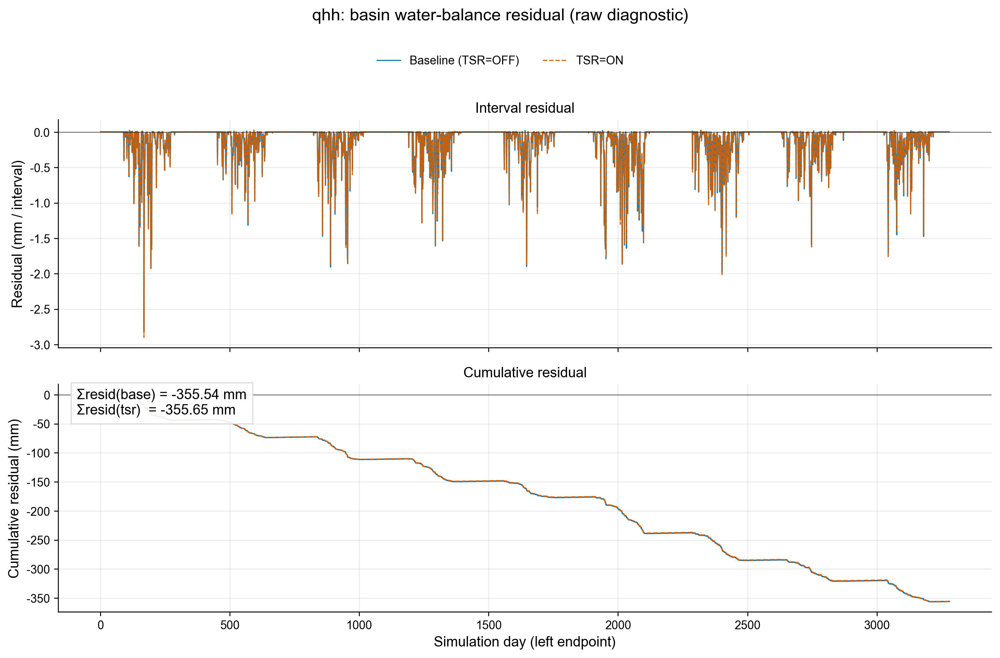

**解读（Residual）**

- heihe：Residual 量级很小（大多数日 < 0.03 mm/interval），TSR=ON 与 Baseline 的差异很小，说明 TSR 并未引入明显额外不守恒。
- qhh：`basinwbfull` 的 **raw 诊断残差** 显著更大（累计约 -356 mm，且峰值约 2.8 mm/interval），且对 TSR 的开关几乎不敏感；但该 raw 残差主要来自 “lake storage + lake evaporation 未纳入 `basinwbfull` 记账”，在加入 `ΔS_lake + E_lake` 后累计残差收敛到约 +9 mm（见 §6）。

---

## 6. qhh：lake module 的“记账”说明（仅用于解释 residual）

qhh 启用了 lake module（可见 `input/qhh/qhh.lake.*` 以及输出的 `qhh.lak*.dat`）。

本仓库当前 `basinwbfull` 的 `ΔS_total / P / ET / Qout` 统计 **不包含**：

- `ΔS_lake`（lake storage change）
- `E_lake`（lake evaporation）

但需要特别澄清：`basinwbfull.P` 的口径是对 **所有 element** 累计 `qElePrep * area`，因此 **lake elements 上的降水已经包含在 `P` 里**，不应再额外扣一次 `P_lake`，否则会造成 **双重计数**（表现为“补了 lake 还是不闭合”）。

为了判断"qhh 的 residual 是否主要由未纳入 lake 项导致"，这里用 lake 输出做了一个 **离线增补**：

$$Residual(+lake) \approx Residual(raw) + \Delta S_{lake} + E_{lake}$$

其中：

- $\Delta S_{lake}$ 用 `lakystage` 与 `lakatop` 的梯形公式估算：$\Delta V \approx 0.5 \times (A_0 + A_1) \times (H_1 - H_0)$
- $E_{lake} = lakvevap \times lakatop$

对比图如下（raw vs +lake）：

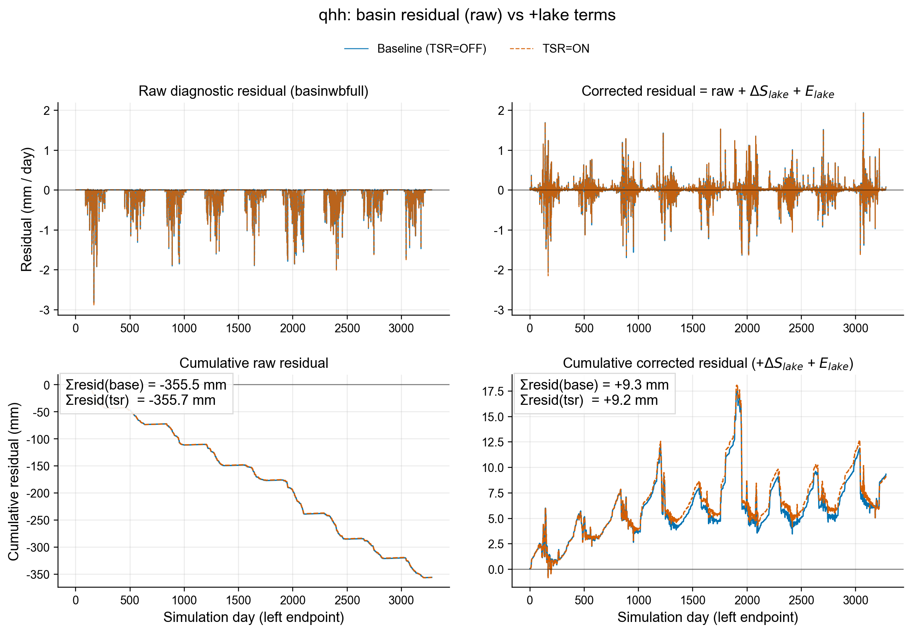

**结论（qhh +lake）**

- 加入 `ΔS_lake + E_lake` 后，qhh 的累计残差从 **约 -356 mm** 显著收敛到 **约 +9 mm**（Baseline：`+9.34 mm`；TSR：`+9.16 mm`；单位均为“全域等效水深”）。
- 因此：qhh 的大幅度负残差 **主要是 `basinwbfull` 的记账口径不含 lake storage + lake evaporation** 导致的“诊断残差”，而不是系统性漏水。

---

## 7. 结论摘要

- **heihe**
  - TSR=ON 后 `rn_factor` 全域中位数约 **0.99**，并产生明确的阴阳坡辐射差异（$\Delta rn_t(S-N) \approx +53.6\ W/m^2$）。
  - 全域量级上，TSR 仅小幅降低 ET（累计约 **-23.5 mm**），对应主要表现为 **储量增加（+23.6 mm）** 与很小的 **出口出流增加（+1.5 mm）**。
  - 全域水量平衡 Residual 很小，TSR=ON 与 Baseline 的差异也很小（累计 Residual 从约 -18.1 mm 变为约 -16.5 mm）。
- **qhh**
  - 南北向坡面占比很小（各约 5%），flat 面积占比约 83%，因此 TSR 的"阴阳坡辐射差异"难以转化为显著全域水文差异（ET 仅减少 ~9 mm，Qout 基本不变）。
  - 全域 Residual 额外纳入 `ΔS_lake + E_lake` 才能做“全域闭合”；加入后累计残差约 **+9 mm**。

---

## 8. 复现实验/图表

重新生成本文模型输出与图表：

```bash
make shud
SHUD_WB_DIAG=1 bash validation/tsr/run_heihe_qhh.sh
python3 post_analysis/plot_heihe_qhh_tsr.py
```

图表输出目录：

- `docs/figures/tsr_heihe_qhh/heihe/`
- `docs/figures/tsr_heihe_qhh/qhh/`
