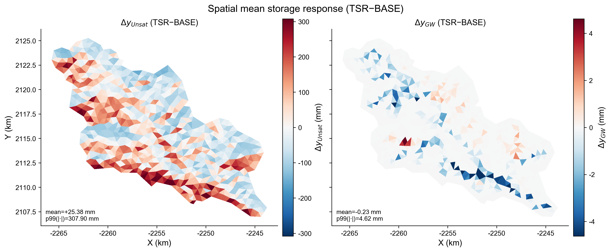
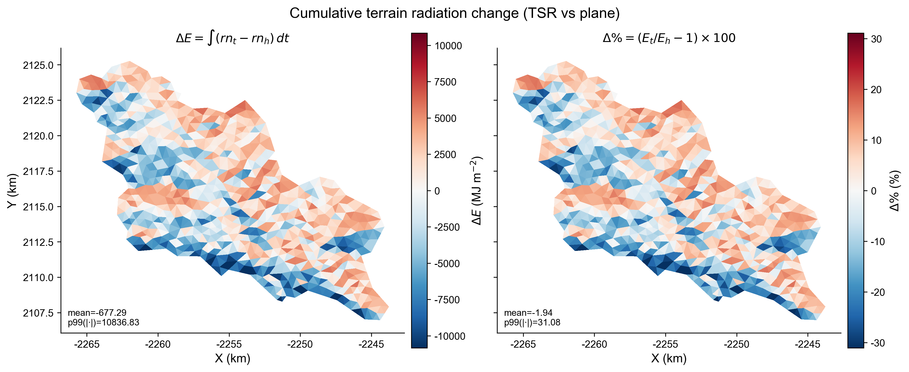
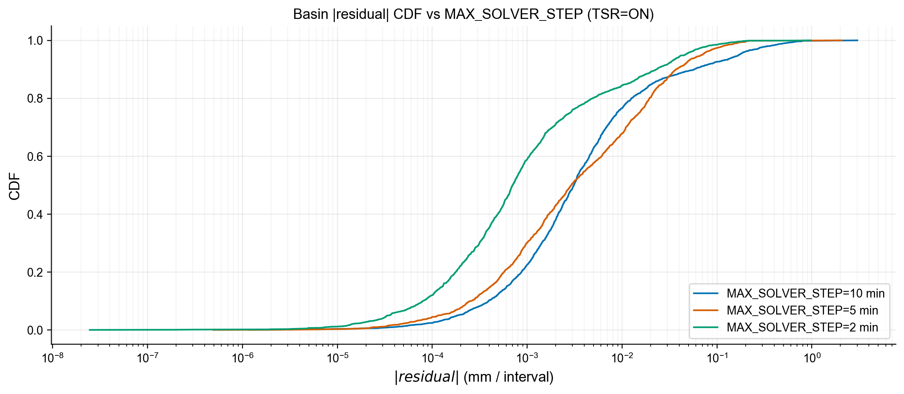
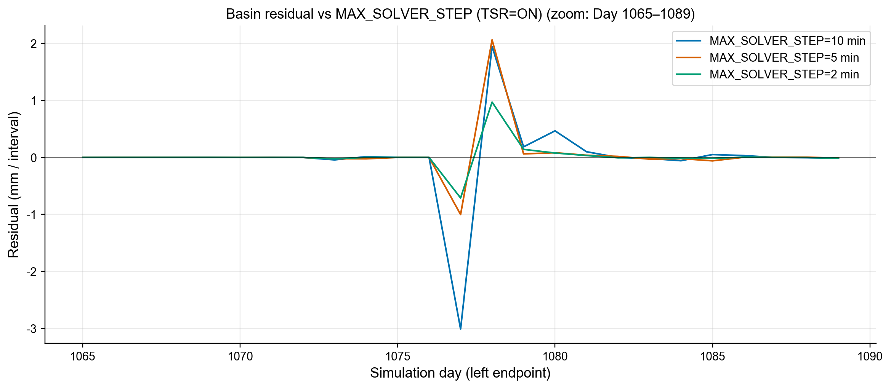
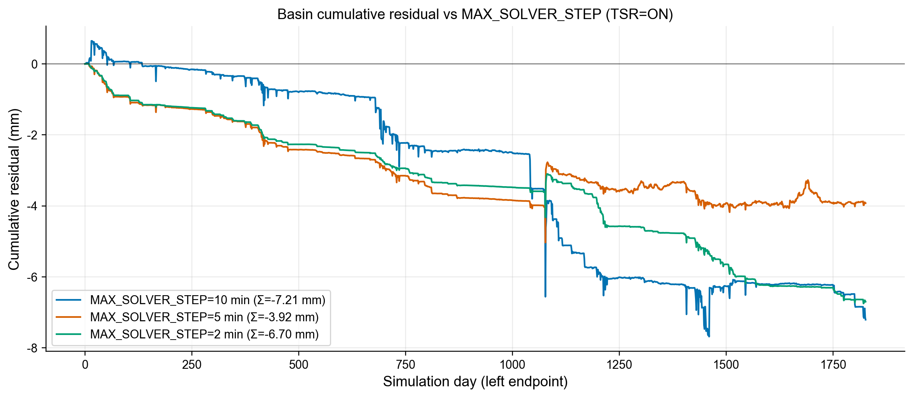
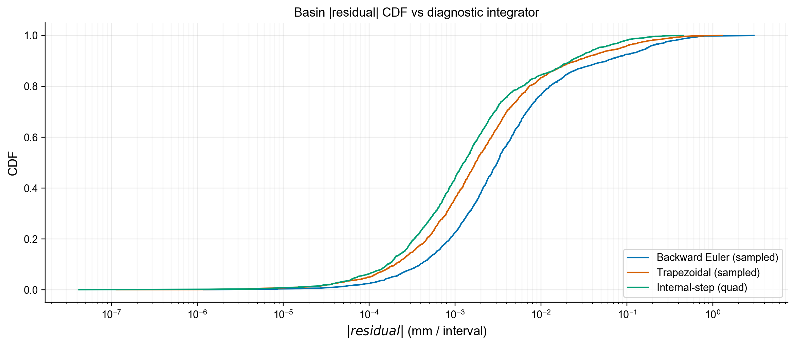
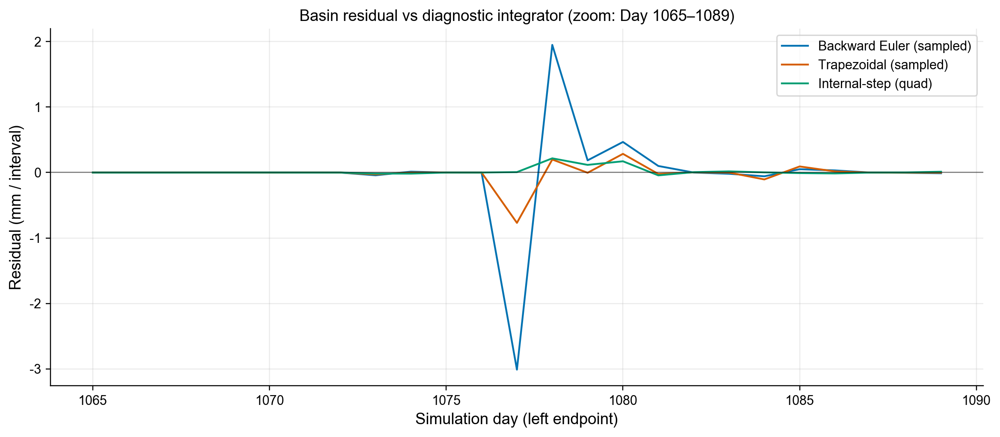
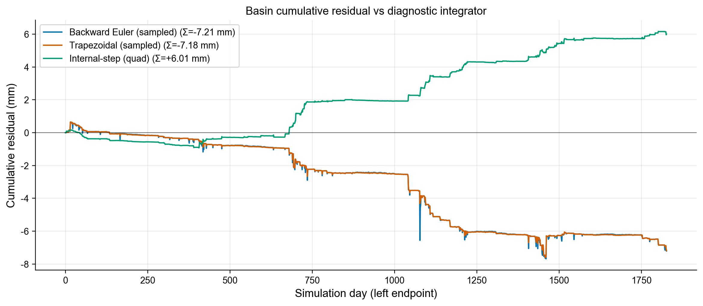
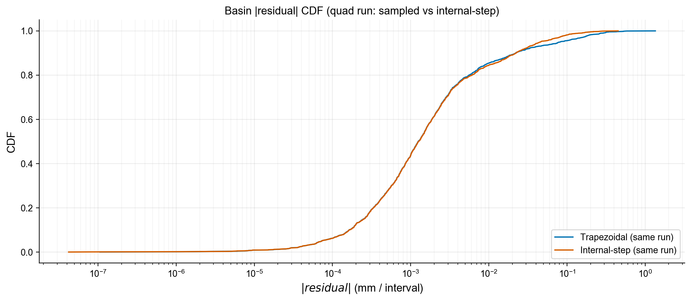
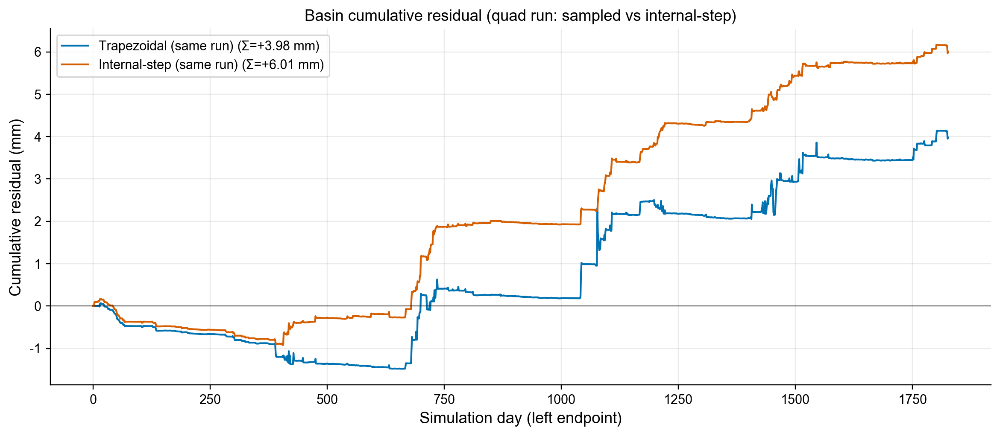

# SHUD 水量平衡验证报告（逐 element + 全域）

本报告对应当前代码仓（`SHUD-up`）中新加入的水量平衡诊断输出，用于：

1) 先做**全域（basin-scale）水量平衡**，其中“域外出流”按 SHUD 习惯取**出口断面流量 Q**（河网 outlet discharge）。  
2) 再做**逐 element 的水量平衡/闭合检查**（不做空间平均；输出为单格点列向量）。

---

## 1. 时间、单位与“残差”的含义

- 时间单位：SHUD 内部时间 `t` 以 **minute** 计（`t_min`）。  
- 逐步采样：按**外部求解步**（默认 `MAX_SOLVER_STEP = 10 min`，或实际配置的 `SolverStep`/ET 子步）在**步末**取一次样。  
- 区间积分：对每个采样点拿到的"瞬时变化率"用**右端点累加（Backward Euler / right-endpoint Riemann sum）**做数值积分：
  $$
  \int_{t_0}^{t_1} r(t)\,dt \approx \sum_k r(t_k)\,\Delta t_k
  $$
- 输出间隔：按 `DT_QE_ET`（若未设置则回退到 `DT_YE_SURF`，再回退到 1440 min）聚合并写盘。
- **残差（residual）不是"某一瞬时的守恒误差"**，而是**一个时间区间**内：
  $$
  \mathrm{resid} = \Delta S - \int \mathrm{rate}\,dt
  $$
  其中 `ΔS` 用区间端点的瞬时状态计算，积分项用区间内采样点的瞬时 rate 积分得到。

输出时间戳沿用 SHUD 习惯写成**区间左端点**：例如 `DT_QE_ET=60` 时，区间 `[0,60]` 的平衡写在 `t=0` 那条记录上。

---

## 2. 单元库容定义（逐 element）

对每个 element `i`，定义（单位：m 水深等效）：

### 2.1 三态库容（仅 ODE 三个状态）
$$
S_3(t) = y_\mathrm{Surf}(t) + S_y\cdot y_\mathrm{Unsat}(t) + S_y\cdot y_\mathrm{GW}(t)
$$

对应代码状态数组：

- `ySurf`：`Model_Data::yEleSurf[i]`
- `yUnsat`：`Model_Data::yEleUnsat[i]`
- `yGW`：`Model_Data::yEleGW[i]`
- `Sy`：`Model_Data::Ele[i].Sy`

### 2.2 全库容（补上雪和拦截）
$$
S_\mathrm{full}(t) = S_3(t) + y_\mathrm{Snow}(t) + y_\mathrm{IS}(t)
$$

对应：

- `ySnow`：`Model_Data::yEleSnow[i]`
- `yIS`：`Model_Data::yEleIS[i]`

---

## 3. 两类逐 element 残差：现在的四个输出文件

本仓库实现了两类残差（都为“区间残差”），分别回答两个不同问题：

### 3.1 A 类：`ΔS − ∫(dS/dt)dt`（来自求解器的瞬时导数）

对应输出：

- `*.elewb3_resid.dat`
- `*.elewbfull_resid.dat`

做法：

1) 在每个外步结束时，调用 `CVodeGetDky(..., k=1, ...)` 得到该时刻状态导数 `DY = dY/dt`。
2) 由导数拼出瞬时库容变化率（单位：m/min）：
   $$
   \frac{dS_3}{dt} = DY_\mathrm{surf} + S_y\,DY_\mathrm{unsat} + S_y\,DY_\mathrm{gw}
   $$
3) 因为雪/拦截不在 ODE 状态里（由 `ET()` 过程更新），对 `Sfull` 用当步的过程量补齐：
   $$
   \frac{dS_\mathrm{full}}{dt}=\frac{dS_3}{dt} + (P - P_\mathrm{net}) - E_\mathrm{IC}^{raw}
   $$
   其中：
   - `P` = `qElePrep[i]`
   - `P_net` = `qEleNetPrep[i]`
   - `E_IC_raw` = `qEleE_IC` 在 `ET()` 刚更新完后立刻 snapshot 的值（避免后续过程改写）

> 解释：A 类残差衡量的是“**端点库容变化**”与“**用求解器瞬时导数做的数值积分**”之间的闭合程度。它主要反映积分离散误差、采样对齐误差，以及 `Sfull` 的补齐项是否自洽；它不是直接把所有通量逐项相加的“通量收支表”。

### 3.2 B 类：`ΔS − ∫(RHS_budget)dt`（来自通量收支的 RHS）

对应输出：

- `*.elewb3_budget_resid.dat`
- `*.elewbfull_budget_resid.dat`

做法：仍然按外步末采样并右端点积分，但 integrand 换成**通量收支 RHS**（单位：m/min）：

- 定义 ET3（不含拦截）：
  $$
  ET_3 = qEs + qEu + qEg + qTu + qTg
  $$
- 定义侧向净出流（面通量）：
  $$
  q_\mathrm{lat,3}=\frac{Q_\mathrm{surf,tot}+Q_\mathrm{sub,tot}}{A}
  $$
- 三态收支 RHS：
  $$
  RHS_3 = P_\mathrm{net} - ET_3 - q_\mathrm{lat,3} + q_\mathrm{BC} + q_\mathrm{SS}
  $$
- 全库容收支 RHS：
  $$
  RHS_\mathrm{full} = P - (ET_3 + E_\mathrm{IC}^{raw}) - q_\mathrm{lat,3} + q_\mathrm{BC} + q_\mathrm{SS}
  $$

对应变量（逐 element `i`）：

- `P`：`qElePrep[i]`
- `P_net`：`qEleNetPrep[i]`
- `qEs/qEu/qEg/qTu/qTg`：`Model_Data::{qEs,qEu,qEg,qTu,qTg}[i]`
- `Q_surf,tot`：`QeleSurfTot[i]`
- `Q_sub,tot`：`QeleSubTot[i]`
- `A`：`Ele[i].area`
- `q_BC`：当 `Ele[i].iBC < 0` 时 `Ele[i].QBC / A`，否则 0
- `q_SS`：当 `Ele[i].iSS != 0` 时 `Ele[i].QSS / A`，否则 0

> 解释：B 类残差是“把关心的外源通量/侧向通量逐项拼成 RHS”后，检查它与 `ΔS` 的闭合。它更接近“水量收支表”的含义；但数值上会比 A 类更敏感（通量场重算、阈值/裁剪、求解器 dense-output 导数与 `f(y)` 的微小差异都会进入）。

---

## 4. 全域水量平衡：`*.basinwbfull.dat`（m³ / 区间）

输出文件：`*.basinwbfull.dat`（每条记录对应一个输出区间；单位均为 **m³/区间**）

包含 9 列（icol=1..9）：

1. `dS_total_m3`：全域总库容变化（Σ element `Sfull*area` + 河道库容变化）
2. `P_m3`：Σ(`qElePrep*area`) dt
3. `ET_m3`：Σ(`(E_IC_raw + qEs+qEu+qEg+qTu+qTg)*area`) dt
4. `Qout_m3`：出口断面外流量积分（自动识别 outlet：`Riv.down<0` 且 `toLake<0`，可多出口求和）
5. `Qedge_m3`：当 `CloseBoundary=0` 时，来自网格边界的净外流积分（边界边的 `QeleSurf+QeleSub` 求和）
6. `Qbc_m3`：BC 通量积分（element `QBC` + river `qBC`）
7. `Qss_m3`：SS 通量积分（element `QSS`）
8. `noncons_edge_sum_m3`：对**内部相邻边**的 `QeleSurf+QeleSub` 直接求和（理想应接近 0，用于排查边通量反对称是否成立）
9. `resid_m3`：
   $$
   \mathrm{resid}=\Delta S_\mathrm{total} - \left(P + Qbc + Qss - ET - Qout - Qedge\right)
   $$

> 解释：全域验证优先看 `resid_m3`，并用流域面积换算成等效水深（mm）判断量级是否可接受。

---

## 5. 复现命令（本仓库自带脚本）

从仓库根目录运行：

```bash
make -j4
SHUD_WB_DIAG=1 bash validation/tsr/run_tsr.sh
```

可选：为了加速验证，可通过环境变量覆盖默认时长/输出间隔（输出频率绑定在 `DT_QE_ET`）：

```bash
SHUD_WB_DIAG=1 SHUD_VALIDATION_END_DAYS=2 SHUD_VALIDATION_DT_QE_ET_MIN=60 \
  bash validation/tsr/run_tsr.sh
```

生成本文档所用可视化图（输出到 `docs/figures/water_balance/`）：

```bash
python3 post_analysis/plot_water_balance_verification.py
```

脚本会生成（或覆盖并备份）`output/ccw.tsr/ccw.*.dat`；水量平衡相关输出位于 `output/ccw.tsr/` 下：

- `ccw.elewb3_resid.dat`
- `ccw.elewbfull_resid.dat`
- `ccw.elewb3_budget_resid.dat`
- `ccw.elewbfull_budget_resid.dat`
- `ccw.basinwbfull.dat`

---

## 6. 本次运行的量化结果与结论（默认时长：END=1827 day, DT_QE_ET=1440 min）

运行配置：

- Case：`input/ccw`
- `END=1827` day（`input/ccw/ccw.cfg.para` 默认值）
- `DT_QE_ET=1440` min（`input/ccw/ccw.cfg.para` 默认值；即按天输出区间）
- 外步：`MAX_SOLVER_STEP=10` min（模型默认）
- `SHUD_WB_DIAG=1`
- 本次实际运行脚本：`validation/tsr/run_tsr.sh`（`TERRAIN_RADIATION=1`）

流域总面积（由 `input/ccw/ccw.sp.mesh` 三角形面积求和得到）：

- `A = 196,402,734 m²`

### 6.0 快速 sanity check（2 天短跑：END=2 day, DT_QE_ET=60 min）

为了在开发期快速验证“是否明显破坏水量守恒”，我们保留了一次 2 天短跑结果：

- Baseline（TSR=OFF）：`output/ccw.base.2d/`（`48` 条记录，`dt=60 min`）
- TSR=ON：`output/ccw.tsr.2d/`（`48` 条记录，`dt=60 min`）

复现命令（生成 `ccw.base.2d/` 与 `ccw.tsr.2d/`，并更新图表）：

```bash
SHUD_WB_DIAG=1 bash validation/tsr/run_ccw_2d.sh
python3 post_analysis/plot_water_balance_verification.py
```

#### 6.0.1 全域（basin）水量平衡（单位：mm/小时区间）

统计对象：`*.basinwbfull.dat` 的 `resid_m3`，换算为等效水深（mm）。

- Baseline（`output/ccw.base.2d/ccw.basinwbfull.dat`）  
  - `max |resid| = 0.00119666 mm`（发生在 `t=2640 min` 的区间）  
  - `mean resid = +0.0000308347 mm`  
  - `rms resid = 0.000211070 mm`  
  - `p95 |resid| = 0.000258713 mm`，`p99 |resid| = 0.000862741 mm`  
  - 全期累计：`Σ resid = +0.00148007 mm`（2 天合计）
- TSR=ON（`output/ccw.tsr.2d/ccw.basinwbfull.dat`）  
  - `max |resid| = 0.00121889 mm`（发生在 `t=2640 min` 的区间）  
  - `mean resid = +0.0000317654 mm`  
  - `rms resid = 0.000215147 mm`  
  - `p95 |resid| = 0.000243136 mm`，`p99 |resid| = 0.000892190 mm`  
  - 全期累计：`Σ resid = +0.00152474 mm`（2 天合计）

结论：2 天短跑（按小时区间）下，全域残差量级为 **0.001 mm/小时区间**，累计误差约 **0.0015 mm/2天**，可视为“数值闭合非常好”。这也说明：如果关注的是**守恒性 bug**（例如漏记/重记某个库容或通量），用短跑往往就能暴露出来。

（图）2 天短跑的全域残差时序（含累计残差）：


#### 6.0.2 逐 element 残差量级（单位：mm/小时区间）

这里统计的是 `|resid|` 的分布（对“时间×element”的所有样本一起统计）。

- A 类（`ΔS − ∫(dS/dt)dt`）  
  - Baseline：`elewb3_resid max=0.0133032 mm, p95=0.000739599 mm, p99=0.00405265 mm`  
  - TSR=ON：`elewb3_resid max=0.0133077 mm, p95=0.000756892 mm, p99=0.00405486 mm`
- B 类（`ΔS − ∫(RHS_budget)dt`）  
  - Baseline：`elewb3_budget_resid max=0.227402 mm, p95=0.0484677 mm, p99=0.116658 mm`  
  - TSR=ON：`elewb3_budget_resid max=0.227347 mm, p95=0.0484760 mm, p99=0.116593 mm`

结论：短跑下 A 类残差可到 **0.01 mm 量级**，B 类残差到 **0.1–0.2 mm 量级**；两者差异主要来自“用 `CVodeGetDky` 的导数积分”与“用通量拼 RHS 积分”的数值敏感性不同（见第 3 节解释）。

### 6.1 全域（basin）水量平衡结论

`output/ccw.tsr/ccw.basinwbfull.dat` 的 `resid_m3` 统计（单位：m³/天区间；时间戳为区间左端点）：

- 记录数：`1827`（`dt=1440 min`）
- `max |resid| = 5.91588e+05 m³`（发生在 `t=1550880 min`，对应 Day `1077` 的区间 `[1550880,1552320]`）
- 折算等效水深：`3.01212 mm`
- `mean resid = -774.764 m³`（`-0.00394477 mm`）
- `rms resid = 24880.0 m³`（`0.126678 mm`）
- `|resid|` 分位数（等效水深，mm/天区间）：`p50=0.00310224`, `p95=0.169881`, `p99=0.511267`
- **全期累计残差**：`Σ resid = -1.41549e+06 m³`（`-7.20710 mm`，按流域面积换算）

结论：在默认 `MAX_SOLVER_STEP=10 min`、按天区间聚合时，**全域水量平衡已能很好闭合**：绝大多数天 `|resid|` 小于 `0.17 mm`（`p95`），最差一天约 `3.0 mm`；全期累计误差约 `-7.2 mm`。

（图）默认全期（1827 天）的全域残差时序（含累计残差）：


（图）默认全期（1827 天）的 `|resid|` 分布（CDF）：


### 6.2 逐 element 水量平衡结论

单位：m（水深等效），统计的是 `|resid|` 的分布：

- A 类（`ΔS − ∫(dS/dt)dt`）  
  - `elewb3_resid`: `max=0.0128919 m`, `p95=0.000101505 m`, `p99=0.000278006 m`  
  - `elewbfull_resid`: `max=0.0128919 m`, `p95=0.000101505 m`, `p99=0.000278006 m`
- B 类（`ΔS − ∫(RHS_budget)dt`）  
  - `elewb3_budget_resid`: `max=0.0131369 m`, `p95=0.000896659 m`, `p99=0.00238105 m`  
  - `elewbfull_budget_resid`: `max=0.0131369 m`, `p95=0.000896659 m`, `p99=0.00238105 m`

结论：

- 在该用例下（默认 `MAX_SOLVER_STEP=10 min`），逐 element 的 A 类残差 `p95≈0.10 mm`，B 类残差 `p95≈0.90 mm`，极端过程可达约 `1 cm`。  
- `elewbfull_*` 与 `elewb3_*` 统计相同，表示雪/拦截（Snow/IS）过程与 `P / NetP / E_IC` 的记账已经自洽闭合（不会再把“全系统”拉出额外残差）。

（图）逐 element `|resid|` 的分布（CDF；对比 A 类与 B 类、baseline 与 TSR）：


### 6.3 TSR 阴阳坡（南北坡）响应：Unsat / GW 差异（ccw，1827 天）

本节用于回答 TSR 加入的核心动机：在地形辐射修正下，**阳坡（南向坡）与阴坡（北向坡）**在能量输入（`rn_t`）、蒸散（`ETa`）以及水量状态（`yUnsat`, `yGW`）上是否出现可解释的差异。

#### 6.3.1 分组与计算方法

- 数据来源：
  - TSR=OFF：`output/ccw.base/*.dat`
  - TSR=ON：`output/ccw.tsr/*.dat`
  - 地形：`input/ccw/ccw.sp.mesh`
- 地形几何：
  - 由三角网格节点高程计算每个 element 的单位法向量 `(nx, ny, nz)`，并按 `src/classes/Element.cpp` 的同一算法计算坡度角 `slopeAngle` 与坡向 `aspect`（North=0, East=π/2）。
- 阴阳坡定义（仅取“有意义的坡面”）：
  - 仅统计 `slopeAngle ≥ 5°` 的 element
  - **阳坡（South-facing）**：`aspect` 落在 `180°±45°`（即 `[135°,225°]`）
  - **阴坡（North-facing）**：`aspect` 落在 `0°±45°`（即 `[315°,360°]∪[0°,45°]`）
- 统计口径：
  - **空间加权**：按 element 面积做面积加权平均
  - **时间口径**：对全期 1827 天日尺度输出取时间平均（输出本身为区间平均/日平均）
- 为避免“库容大小受缺水层厚度影响”的混淆，同时计算一个无量纲指标：
  - `UnsatRatio = yUnsat / (AquiferDepth - yGW)`（`AquiferDepth` 来自 mesh 的 `AqDepth`）
  - 在 SHUD 内部对应 `theta/ThetaS`（见 `src/classes/Element.cpp::_Element::updateElement`），可理解为“非饱和带相对湿润程度”。
- 复现脚本：`post_analysis/analyze_aspect_response.py`

分组规模（`slope≥5°` 且 `±45°` 窗口）：

- 阳坡：`305` 个 element，面积占比 `0.268178`
- 阴坡：`246` 个 element，面积占比 `0.213031`
- 额外背景（面积加权）：阳坡平均高程 `906.915 m`，阴坡 `875.814 m`；两组平均含水层深度均为 `30 m`

（图）坡向分组面积占比（含 flat 与其它坡向；用于解释“为何阳坡+阴坡+flat 不等于总单元数”）：


#### 6.3.2 结果（面积加权 + 时间平均）

下表的 `Δ` 均为 `阳坡 - 阴坡`。

| 模式 | rn_t (W/m²) | ETa (mm/day) | yUnsat (m) | UnsatRatio (-) | yGW (m) |
|---|---:|---:|---:|---:|---:|
| TSR=OFF | 220.906 / 220.906 (Δ=0) | 1.63007 / 1.54553 (Δ=0.0845443) | 9.49029 / 8.88077 (Δ=0.609527) | 0.345870 / 0.322304 (Δ=0.0235658) | 2.43978 / 2.17816 (Δ=0.261617) |
| TSR=ON  | 245.050 / 180.827 (Δ=64.2232) | 1.65068 / 1.50010 (Δ=0.150583) | 9.40452 / 9.05175 (Δ=0.352762) | 0.342632 / 0.328534 (Δ=0.0140981) | 2.43962 / 2.17783 (Δ=0.261783) |

TSR=ON 下的季节性差异（`Δ = 阳坡 - 阴坡`，按月分组：4–9 月为夏季、10–3 月为冬季）：

- `rn_t`：全期 `Δ=64.2232 W/m²`；夏季均值 `38.6391 W/m²`；冬季均值 `89.8914 W/m²`
- `ETa`：全期 `Δ=0.150583 mm/day`；夏季均值 `0.185505 mm/day`；冬季均值 `0.115545 mm/day`

（图）南北坡差异随时间变化（baseline vs TSR；South−North）：


（图）南北坡水量状态差异随时间变化（yUnsat / UnsatRatio / yGW；并显示 TSR 对“南北差异”的净效应 ΔTSR−ΔBASE）：


（图）TSR 对全期平均水量状态的空间响应（TSR−BASE；`yUnsat` 与 `yGW`，单位 mm；色标为 `p99(|·|)` 对称截断以提升可读性）：



（图）逐 element 的**累计辐射**相对“平面基准”（`rn_h`）的变化（全期积分；`rn_t` vs `rn_h`；单位 MJ/m² 与 %；色标为 `p99(|·|)` 对称截断）：



#### 6.3.3 TSR 带来的“阴阳坡差异变化”（TSR=ON − TSR=OFF）

对比两组的均值变化（`TSR − OFF`）：

- 阳坡：`rn_t +24.1440 W/m²`，`ETa +0.0206151 mm/day`，`yUnsat -0.0857762 m`，`UnsatRatio -0.00323819`，`yGW -0.000159972 m`
- 阴坡：`rn_t -40.0792 W/m²`，`ETa -0.0454233 mm/day`，`yUnsat +0.170988 m`，`UnsatRatio +0.00622948`，`yGW -0.000326070 m`

据此得到的关键结论：

1) **TSR 明确放大了能量与蒸散的阴阳坡差异**：`rn_t` 由 `Δ≈0` 变为 `Δ≈64 W/m²`，`ETa` 的阴阳坡差异从 `0.0845` 增至 `0.1506 mm/day`。  
2) **TSR 使阴坡更“湿”、阳坡更“干”**：阴坡 `UnsatRatio` 上升、阳坡下降，使南北差异从 `0.0236` 降到 `0.0141`（约 **40% 收敛**）；对应的 `yUnsat` 也表现为阴坡增加、阳坡减少。  
3) **地下水（`yGW`）对 TSR 的长期均值响应极弱**：阴阳坡 `yGW` 差异基本不变（`≈0.262 m`），说明在该用例参数与时间尺度下，TSR 主要通过改变 ET/非饱和带水量来体现，而不是显著重塑地下水格局。  

### 6.4 MAX_SOLVER_STEP 收敛性实验（TSR=ON）

动机：解释“全域 residual 只在少数时刻尖峰”的来源，并验证是否主要来自**区间积分的离散误差**（外步采样 + 右端点累加）。

实验设置：保持 ccw 用例的默认模拟时长与输出配置不变，仅改变 `MAX_SOLVER_STEP`：

- `END=1827 day`
- `DT_QE_ET=1440 min`（按天区间）
- `ET/forcing step=60 min`（保持不变）
- `TERRAIN_RADIATION=1`（TSR=ON）
- `SHUD_WB_DIAG=1`
- `MAX_SOLVER_STEP ∈ {10, 5, 2} min`

复现脚本（会生成 `5 min` 与 `2 min` 两组额外输出目录）：

```bash
SHUD_WB_DIAG=1 bash validation/tsr/run_tsr_maxstep_experiments.sh
python3 post_analysis/plot_water_balance_verification.py
```

对应输出目录：

- `MAX_SOLVER_STEP=10 min`：`output/ccw.tsr/`
- `MAX_SOLVER_STEP=5 min`：`output/ccw.tsr.ms5/`
- `MAX_SOLVER_STEP=2 min`：`output/ccw.tsr.ms2/`

统计对象：`ccw.basinwbfull.dat` 的 `resid_m3`，按流域面积折算为等效水深（mm/天区间）。

| MAX_SOLVER_STEP | max \|resid\| (mm) | rms (mm) | p95 \|resid\| (mm) | p99 \|resid\| (mm) | Σ resid (mm) | peak day | runtime (s) |
|---:|---:|---:|---:|---:|---:|---:|---:|
| 10 min | 3.01212 | 0.126678 | 0.169881 | 0.511267 | -7.20710 | 1077 | 300.241 |
| 5 min  | 2.06351 | 0.0621424 | 0.0696624 | 0.159805 | -3.92447 | 1078 | 493.473 |
| 2 min  | 0.971240 | 0.0362627 | 0.0456349 | 0.123794 | -6.70023 | 1078 | 1006.562 |

#### 6.4.1 如何解读“累计残差不单调”

`Σ resid` 是**带符号**的累计量（全期把每天的 `resid` 直接相加），因此它不保证随 `MAX_SOLVER_STEP` 减小而单调变小：

- `resid` 既可能为正也可能为负；当步长变化时，**误差的正负分布**和“抵消程度”会变，从而影响最终累计值。  
- 步长变小通常会降低“每天误差的幅度”（variance），但并不必然消除一个很小的**偏置项**（bias）；因此 `Σ resid` 可能出现“先变小、再变大”的非单调现象。  
- CVODE 的自适应内部步进会随容差与外步上限改变，导致解轨迹与采样点略有差异，累计值也会随之变化。  

因此，用于评估“离散误差是否收敛”的更稳健指标应以**误差幅度**为主（如 `rms`、`p95/p99`、或 `Σ|resid|`）。本实验中这些指标都随步长减小而明显下降：`Σ|resid| = 55.86 / 28.88 / 15.75 mm`（对应 `10 / 5 / 2 min`）。

补充：**`|resid|` 的 CDF 图没有额外“物理含义”**——它只是把每天的 `|resid|` 当成一个样本集合做经验分布。  
横轴是残差幅度阈值 `x`，纵轴是比例 `P(|resid|≤x)`；曲线整体越向左，代表“在同样概率水平下残差更小”，即数值闭合更好。

结论：

1) **残差随外步减小明显下降（表现出收敛性）**：`rms` 从 `0.1267 → 0.0621 → 0.0363 mm`，分布尾部也显著收敛（`p99` 从 `0.511 → 0.160 → 0.124 mm`）。  
2) **尖峰主要是“大通量/快速变化日”叠加离散积分误差**：最大尖峰日稳定出现在 Day `1077–1078` 附近；减小 `MAX_SOLVER_STEP` 后尖峰幅度显著降低。  
3) **代价是运行时间增加**：`10→5→2 min` 的 wall time 约 `300→493→1007 s`（同一机器/同一设置）。  
4) **这种收敛性更支持“诊断积分/采样误差”为主因，而非模型过程本身系统性漏水**：如果是记账漏项/通量符号错误等守恒性 bug，通常不会随着步长减小而如此一致地降低。  

（图）不同 `MAX_SOLVER_STEP` 下全域 `|resid|` 分布（CDF，对比收敛趋势）：



（图）围绕最大尖峰日的残差时序放大图（对比“尖峰收敛”）：



（图）不同 `MAX_SOLVER_STEP` 下全期累计 residual（按天区间累加；用于对比长期漂移/累计闭合误差）：



---

### 6.5 诊断积分方法对比（BE / TRAPZ / QUAD）

本节专门回答：**残差在少数时刻特别突出**，究竟更像是“模式漏水/不守恒”，还是“诊断积分与采样造成的数值误差”。  
思路是：在不改动物理过程的前提下，改进“区间积分”的数值方法，看残差是否显著降低。

对比三种诊断积分方式（全域，单位：mm/天区间；统计对象为 `ccw.basinwbfull*.dat` 的 `resid_m3`）：

- **BE（Backward Euler / 右端点累加）**：`Σ rate(t_k)·Δt`（默认实现）  
- **TRAPZ（梯形积分）**：`Σ 0.5·(rate_k + rate_{k-1})·Δt`（`SHUD_WB_DIAG_TRAPZ=1`）  
- **QUAD（内部步积分，basin-only）**：用 `CV_ONE_STEP` 驱动 CVODE，在**内部自适应步长**上累积 basin 通量（`SHUD_WB_DIAG_QUAD=1`），输出 `*.basinwbfull_quad.dat`

复现脚本：

```bash
make -j4
SHUD_WB_DIAG=1 bash validation/tsr/run_tsr_wb_integrators.sh
python3 post_analysis/plot_water_balance_verification.py
```

结果汇总（TSR=ON，END=1827 day，DT_QE_ET=1440 min；单位：mm/天区间）：

| 方法                                   | max \|resid\| (mm) |  rms (mm) | p95 \|resid\| (mm) | p99 \|resid\| (mm) | Σ resid (mm) | Σ\|resid\| (mm) | peak day | runtime (s) |
| ------------------------------------ | -----------------: | --------: | -----------------: | -----------------: | -----------: | --------------: | -------: | ----------: |
| BE（sampled）                          |            3.01212 |  0.126678 |           0.169881 |           0.511267 |     -7.20710 |         55.8591 |     1077 |     300.609 |
| TRAPZ（sampled）                       |            1.28528 | 0.0662579 |          0.0837112 |           0.314821 |     -7.18271 |         29.8973 |     1461 |     298.899 |
| QUAD（internal-step；basinwbfull_quad） |           0.451164 | 0.0301388 |          0.0456953 |           0.150019 |      6.01016 |         17.0349 |      700 |     373.377 |

结论：

1) **TRAPZ 基本把“采样积分误差”砍半**：`rms` 与 `p95` 约下降 40–50%，而运行时间几乎不变（在 ccw 用例中 `~300s` 量级）。  
2) **QUAD 进一步明显压低尾部与尖峰**：`max|resid|` 从 `~1.3 mm` 降到 `~0.45 mm`，`p99` 从 `~0.315 mm` 降到 `~0.150 mm`。代价是运行时间增加（ccw 中约 `+24%`）。  
3) 以上现象更支持“残差主要来源于诊断积分/采样离散误差”而非系统性漏项：若是物理过程漏记账，单纯改积分方法通常不会如此一致地降低误差幅度。

（图）不同诊断积分方法下全域 `|resid|` 分布（CDF）：



（图）围绕 BE 最大尖峰日（Day 1077）的残差时序放大图：



（图）不同诊断积分方法下的全期累计 residual（用于对比长期漂移/累计闭合误差）：



为了在**同一条数值解轨迹**上隔离“积分方法”的影响，在 QUAD-run（`output/ccw.tsr.wb.trapzquad/`）里同时输出了：

- `ccw.basinwbfull.dat`：仍按“外步采样 + TRAPZ”积分  
- `ccw.basinwbfull_quad.dat`：按“CVODE 内部步长”积分

（图）同一 QUAD-run 内：sampled-TRAPZ vs internal-step 的 `|resid|` CDF 与累计 residual：





### 6.6 强迫幅度敏感性：放大降水（`TS_PRCP=5`）

动机：“把 `TS_PRCP` 设为一个明显大于 1 的值（例如 5），看水量守恒检验会放大到什么程度”。该实验等价于把 forcing 的降水强迫整体放大 5 倍，属于对数值稳定性与守恒诊断的压力测试。

实验设置（与默认全期一致，仅改 `TS_PRCP`）：

- Case：`input/ccw`，TSR=ON
- 模拟：`END=1827 day`，输出区间 `DT_QE_ET=1440 min`
- 求解器外步上限：`MAX_SOLVER_STEP=10 min`
- 水量诊断：`SHUD_WB_DIAG=1`（BE / sampled；未启用 TRAPZ/QUAD）
- 变更：`TS_PRCP: 1 → 5`
- 输出目录：`output/ccw.tsr.prcp5/`

复现命令：

```bash
make -j4
SHUD_WB_DIAG=1 bash validation/tsr/run_ccw_prcp5.sh
python3 post_analysis/plot_water_balance_verification.py
```

#### 6.6.1 全域（basin）残差放大幅度（单位：mm/天区间）

对比 `ccw.basinwbfull.dat` 的 `resid`（折算为等效水深，mm）：

| TS_PRCP | ΣP (mm) | max \|resid\| (mm) | rms (mm) | p95 \|resid\| (mm) | p99 \|resid\| (mm) | Σ resid (mm) | Σ\|resid\| (mm) |
|---:|---:|---:|---:|---:|---:|---:|---:|
| 1 | 4021.88 | 3.01212 | 0.126678 | 0.169881 | 0.511267 | -7.20710 | 55.8591 |
| 5 | 20109.41 | 4.17004 | 0.348101 | 0.713730 | 1.62646 | -59.9571 | 209.765 |

要点：

- `ΣP` **严格 ×5**（说明 `TS_PRCP=5` 生效）。
- `|resid|` 的幅度整体变大，但并非简单按 5 倍线性放大：`rms ×2.75`，`p95 ×4.20`，`p99 ×3.18`，`max ×1.38`。
- 相对尺度上（用 `ΣP` 归一）：
  - `|Σresid|/ΣP` 从 `0.179%` 增至 `0.298%`（累计偏置相对略增）
  - `Σ|resid|/ΣP` 从 `1.39%` 降至 `1.04%`（残差幅度相对降水总量反而略降）

#### 6.6.2 逐 element 残差的放大更明显（单位：mm/天区间）

对比 `ccw.elewb3_resid.dat`（A 类：`ΔS − ∫(dS/dt)dt`）与 `ccw.elewb3_budget_resid.dat`（B 类：`ΔS − ∫(RHS_budget)dt`）的 `|resid|` 分布：

- A 类（`elewb3_resid`）
  - `p95 |resid|`：`0.102 → 0.464 mm`（`×4.57`）
  - `p99 |resid|`：`0.278 → 1.320 mm`（`×4.75`）
  - `max |resid|`：`12.9 → 939 mm`（出现极端 outlier）
- B 类（`elewb3_budget_resid`）
  - `p95 |resid|`：`0.897 → 1.391 mm`（`×1.55`）
  - `p99 |resid|`：`2.381 → 3.176 mm`（`×1.33`）
  - `max |resid|`：`13.1 → 892 mm`

该 outlier 发生在 Day 1077、element 183：`elewb3_resid ≈ -939 mm`，而同一天的**全域**残差仅 `≈ -0.87 mm`（当天 `P≈289.6 mm/day`）。这表明：

- 在强迫被放大后，逐 element “区间残差”会对**强非线性/大通量日**更敏感，可能出现非常极端的局地诊断偏差；
- 但它不必然意味着全域出现同量级“漏水”，因此逐 element 验证建议配合更稳健的诊断设置（如 `SHUD_WB_DIAG_TRAPZ=1`、更小 `MAX_SOLVER_STEP`，或 basin-only 的 `SHUD_WB_DIAG_QUAD=1`）再做收敛性确认。

## 7. 已知注意事项 / 可能的误差来源

1) **积分离散误差**：当前区间积分是右端点累加；若把 `MAX_SOLVER_STEP` 进一步减小（或提高采样频率），残差通常会继续下降（见 §6.4）。  
2) **`CVodeGetDky` 与 `f(y)` 的细微差异**：A 类用 dense output 的 `dY/dt`，B 类用通量场拼 RHS（通量场由 `f(t,y)` 重算）。这两者在数值上不会保证完全相同，B 类因此更“敏感”。  
3) **BC/SS 单位约定**：`Element.hpp` 注释写 `QBC`/`QSS` 是 `m3/day`，但它们在 ODE 里直接以 `QBC/area`、`QSS/area` 进入 `DY`（模型时间单位为 minute）。因此请以模型输入/内部实现为准核对单位；本次 ccw 用例中 `iBC=0,iSS=0`，对统计无影响。  
4) **湖泊模块**：`basinwbfull` 当前统计了 element `Sfull` 和 river storage；若启用 lake module 并希望严格全域闭合，需要额外把 **lake storage change（`ΔS_lake`）** 与 **lake evaporation（`E_lake`）** 纳入预算（lake–river/element 的交换通量在全域层面属于内部通量，一般会相互抵消）。  
   注意：`basinwbfull.P` 的口径是对 **所有 element** 累计 `qElePrep * area`，因此 **lake elements 上的降水已包含在 `P` 中**；离线“补账”时不应再扣 `P_lake`，否则会双重计数。一个与当前 `basinwbfull` 口径一致的修正是：`resid_full ≈ resid_raw + ΔS_lake + E_lake`（其中 `ΔS_lake` 可由 `lakystage+lakatop` 估算，`E_lake = lakvevap*lakatop`）。
5) **拦截库容守恒性（已修复）**：此前 `ET()` 中拦截库容 `yEleIS` 在“写入时乘 `VegFrac`，读取时未除回去”，会在降雨期系统性丢失水量（表现为全域累计残差可达数百 mm）。当前版本已在 `src/ModelData/MD_ET.cpp` 修复：读取 `icStg` 时按 `icStg = yEleIS / VegFrac` 还原到冠层（植被覆盖部分）的库容变量，从而使 Snow/IS 子过程与 `P / NetP / E_IC` 完整闭合。

---

## 8. 代码与输出实现位置（便于继续扩展）

- 诊断实现：`src/Model/WaterBalanceDiag.hpp`、`src/Model/WaterBalanceDiag.cpp`
- 采样/写盘对齐（确保通量场与 accepted solution 一致）：`src/Model/shud.cpp`
- 开启方式（默认关闭，避免影响运行速度）：运行时环境变量 `SHUD_WB_DIAG=1`
  - `SHUD_WB_DIAG_TRAPZ=1`：将区间积分由右端点累加改为**梯形积分**（对 A/B 类残差都有帮助，开销很小）
  - `SHUD_WB_DIAG_QUAD=1`：在每个 `SolverStep` 内改用 `CV_ONE_STEP` 驱动 CVODE，并在**内部自适应步长**上累计 basin 通量（更接近“quadrature”的效果，但会明显变慢）；对应输出 `*.basinwbfull_quad.dat`

---

## 9. 深入：残差到底是“诊断误差”还是“SHUD 实现不守恒”？

本节从**实现层面**给出一个更明确的判别与归因：当看到 `basinwbfull.resid` 或 `elewb*_resid` 长期不为 0 时，究竟意味着什么、以及哪些实现细节可能造成“看起来不守恒”。

### 9.1 ccw 本例：从配置上看，系统应当如何闭合？

本仓库默认验证用例 `input/ccw` 的关键事实：

- **无 BC/SS**：`input/ccw/ccw.sp.att` 里 `BC=0`、`SS=0`；因此全域预算里 `Qbc=Qss=0`（`ccw.basinwbfull.dat` 也确实恒为 0）。
- **边界关闭**：`Qedge_m3` 在本次 ccw 全期输出中恒为 0，意味着本用例等价于**封闭边界**（水只能经河网 outlet 外排）。
- **无 lake**：`input/ccw` 没有 lake bathymetry/配置文件；因此全域库容统计仅需 element + river 即可闭合。

在这些前提下，全域连续方程的“理论闭合”应当是：

$$
\Delta S_{\text{ele+river}} \;\approx\; \int (P - ET)\,dt \; -\; \int Q_{out}\,dt
$$

因此在 ccw 里看到残差，优先应把它解释为**数值/离散误差**（求解器误差、采样误差、积分误差），而不是“漏记账项”。

### 9.2 证据链：尖峰残差主要发生在“大通量/快速变化日”

对 `output/ccw.tsr/ccw.basinwbfull.dat`（按天区间）统计可得：

- `|resid|` 与大通量项显著相关：
  - `corr(|resid|, P) ≈ 0.6017`
  - `corr(|resid|, dS_total) ≈ 0.5814`
  - `corr(|resid|, Qout) ≈ 0.4363`
- 尖峰日示例（单位：m³/天区间）：
  - Day 1077：`P=1.1375e7`，`dS=1.0545e7`，`Qout=1.477e5`，`resid=-5.916e5`（≈ `3.01 mm`）
  - Day 1078：`P=1.8008e7`，`dS=1.1344e7`，`Qout=6.931e6`，`resid=+3.831e5`
- 残差“主要由少数事件贡献”的特征很明显：按 `Σ|resid|` 贡献度，Top 10 天约贡献 `20.62%`，Top 100 天约贡献 `68.83%`。

这类统计特征更像“**强迫/通量快速变化时的离散误差放大**”，而不像“某个项长期漏记导致的稳定漂移”（后者更接近均匀/持续的偏置）。

### 9.3 进一步判别：有没有“系统性漏水”的硬证据？

#### 9.3.1 内部通量是否严格互为相反数？

`basinwbfull` 的 `noncons_edge_sum_m3` 是对**内部相邻边**的 `QeleSurf+QeleSub` 直接求和（理想应为 0，用于排查内部边通量是否反对称）。

ccw 全期结果显示该项在数值上基本是**机器零**（`max|noncons_edge_sum| ~ 1e-10 m³/天区间`），说明：

- element–element 的侧向通量在实现上**高度反对称**；
- “水量漏失”不太可能来自“内部边通量符号/配对错误”。

#### 9.3.2 步长变小/积分更精细是否能系统性降低残差幅度？

见 §6.4 与 §6.5：减小 `MAX_SOLVER_STEP`、或将区间积分由 BE 改为 TRAPZ/QUAD，都会显著降低 `rms/p95/p99/max|resid|`。  
这种“幅度随数值精度改善而收敛”的行为，更符合**诊断积分误差/数值误差**，而不是“过程项漏记”。

#### 9.3.3 “累计 residual”是否说明长期不可用？

以 BE（sampled）为例，ccw 全期：

- 累计降水 `ΣP ≈ 4021.88 mm`
- 累计残差 `Σresid ≈ -7.21 mm`（约 `0.18%`，即 `~1792 ppm`）

在这一量级下，它更像是“长期随机误差叠加 + 少量偏置”的结果，而不是会快速发散到主导水量尺度的“致命不守恒”。  
另外，`Σresid` **不保证**随步长/积分方法单调（见 §6.4.1），因此“累计曲线看着差不多”并不能单独证明模式实现有问题。

### 9.4 实现层面：哪些机制可能在别的用例里造成“看起来不守恒”？

下面这些点是“实现上可能引入系统性偏差/漏记账”的高风险来源（ccw 未必触发，但在其它配置可能触发）：

1) **Lake module 记账不全**  
   当前 `basinwbfull` 默认只统计 element `Sfull` + river storage；若启用 lake，需要额外把 lake storage/outflow/inflow 纳入全域预算（见 §7 的第 4 条）。  
   尤其要注意：`basinwbfull.ET` 的口径是 `qEleE_IC_raw + qEs + qEu + qEg + qTu + qTg`，对 lake elements 来说这些项通常为 0，因此 **open-water evaporation 不在 `basinwbfull.ET` 里**；若要做严格全域闭合，需额外加入 `E_lake`（见 §7 的第 4 条修正公式）。  
   另外注意：`src/ModelData/MD_Lake.cpp` 里 `LakeInitialize()` 计算 `lake[i].area` 的循环目前写成 `lake[i].area += Ele[i].area;`（索引看起来应为 `Ele[j].area`），在有 lake 的用例里可能影响 lake 面积/库容换算，从而影响“看起来守恒不闭合”的程度。

2) **固定水位（Head）类边界条件**  
   - element：`Ele[i].iBC > 0` 时，GW 以 `yBC` 强行固定，`DY_gw=0`（`src/ModelData/MD_f.cpp`），其“隐含外通量”不会自动出现在 `P/ET/Qout/Qedge` 里；如果把它当成封闭系统做预算，必然出现残差。  
   - river：`Riv[i].BC > 0` 时同理（固定 stage）。

3) **防负值/稳定性限幅导致的“方程修改”**  
   - 河道方程里对 `dA/dt` 有一个防止“负面积”的限幅：`if (DY < -u_CSarea) DY = -u_CSarea;`（`src/ModelData/MD_f.cpp`）。极端干涸/骤降情况下，这会把连续方程“截断”，从而在严格意义上不再与原始通量完全一致。  
   - `fun_dAtodY()` 在 `bankslope != 0` 时使用二次式求解（`src/Equations/functions.hpp`），更像是“1 分钟步长下的面积增量→水位增量”映射；在强非线性几何、且 solver 内部步长≠1min 的情形里，可能引入额外的数值偏差（ccw 的 river type 参数里 `BankSlope=0`，因此该分支不触发）。

4) **诊断层面的“变量复用/后写覆盖”**  
   例如 `qEleE_IC` 会在 `ET()` 更新后、又在 `f_etFlux()` 内被用于能量分配并可能被覆盖（`src/ModelData/MD_ET.cpp`）。如果诊断直接用“后续被覆盖的 qEleE_IC”，而不是 snapshot（本仓库用 `E_IC_raw` 解决），会产生看似“全库容不守恒”的系统性残差。

### 9.5 结论

就 ccw（1827 天）这个默认验证用例而言：

- **没有发现“系统性漏项/漏水”的硬证据**：内部边通量反对称（`noncons_edge_sum≈0`），残差尖峰与大通量过程强相关，且幅度随数值精度提升明显下降。  
- 当前看到的 residual 更应解释为：**求解器误差 + 采样/区间积分离散误差 + 少量实现保护性限幅在极端时刻的影响**。  
- 因此它并不必然意味着“不能做长时段模拟”；但如果你要把水量闭合做到更严（例如用于同化或极敏感的长期水资源结余分析），推荐优先使用 TRAPZ 或 QUAD 的诊断方式，并适当收紧容差/步长（同时确保所有启用模块的 storage/outflow 都纳入预算）。
