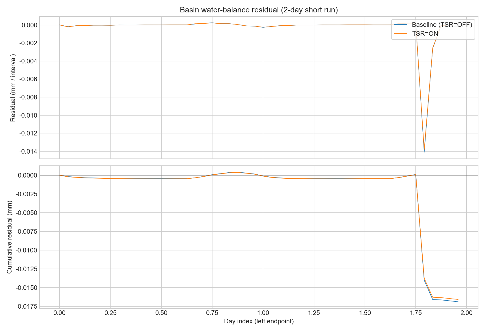
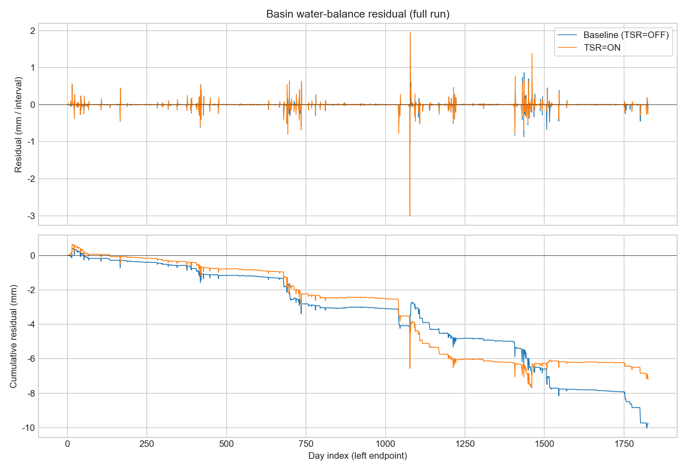
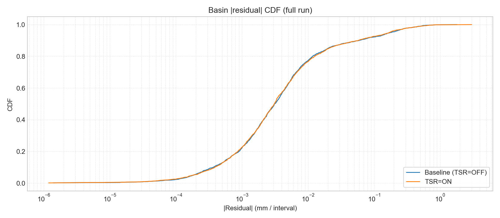
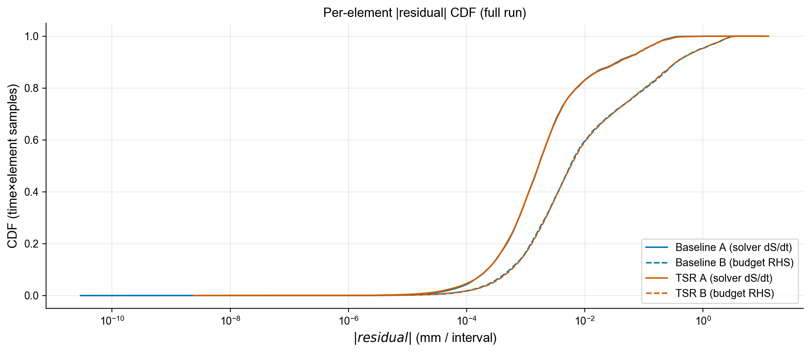
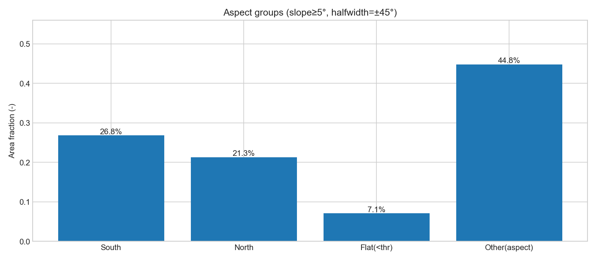
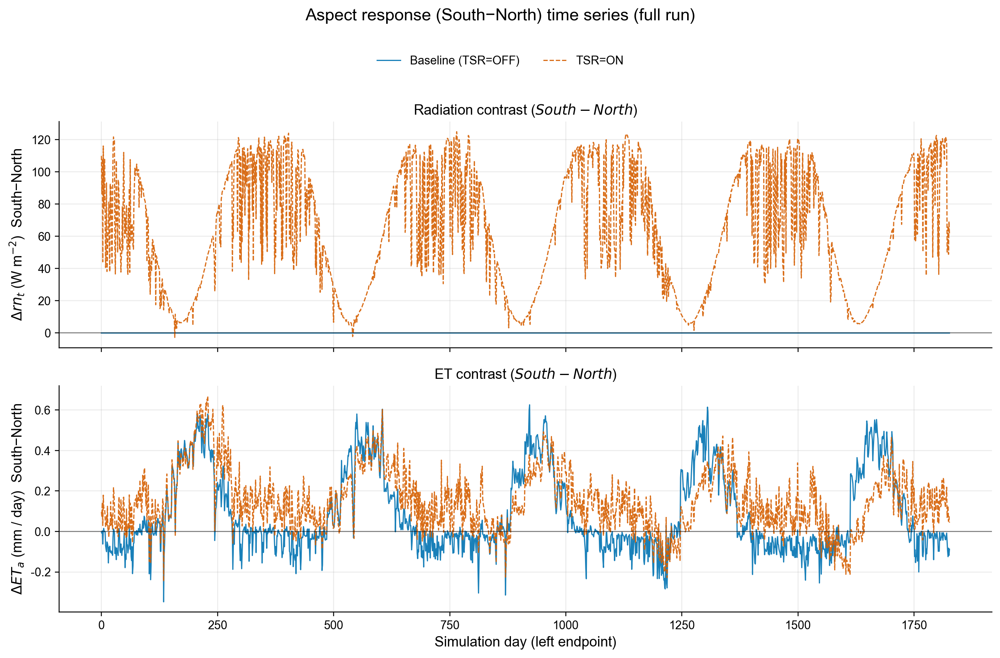
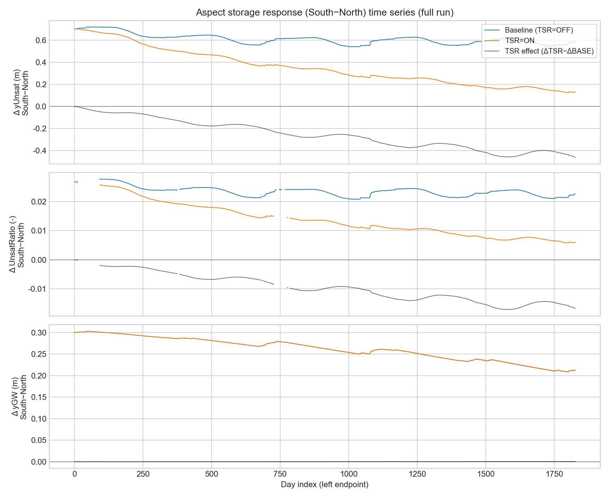

# SHUD 水量平衡验证报告（逐 element + 全域）

本报告对应当前代码仓（`SHUD-up`）中新加入的水量平衡诊断输出，用于：

1) 先做**全域（basin-scale）水量平衡**，其中“域外出流”按 SHUD 习惯取**出口断面流量 Q**（河网 outlet discharge）。  
2) 再做**逐 element 的水量平衡/闭合检查**（不做空间平均；输出为单格点列向量）。

---

## 1. 时间、单位与“残差”的含义

- 时间单位：SHUD 内部时间 `t` 以 **minute** 计（`t_min`）。  
- 逐步采样：按**外部求解步**（默认 `MAX_SOLVER_STEP = 10 min`，或实际配置的 `SolverStep`/ET 子步）在**步末**取一次样。  
- 区间积分：对每个采样点拿到的"瞬时变化率"用**右端点累加（Backward Euler / right-endpoint Riemann sum）**做数值积分：
  $$
  \int_{t_0}^{t_1} r(t)\,dt \approx \sum_k r(t_k)\,\Delta t_k
  $$
- 输出间隔：按 `DT_QE_ET`（若未设置则回退到 `DT_YE_SURF`，再回退到 1440 min）聚合并写盘。
- **残差（residual）不是"某一瞬时的守恒误差"**，而是**一个时间区间**内：
  $$
  \mathrm{resid} = \Delta S - \int \mathrm{rate}\,dt
  $$
  其中 `ΔS` 用区间端点的瞬时状态计算，积分项用区间内采样点的瞬时 rate 积分得到。

输出时间戳沿用 SHUD 习惯写成**区间左端点**：例如 `DT_QE_ET=60` 时，区间 `[0,60]` 的平衡写在 `t=0` 那条记录上。

---

## 2. 单元库容定义（逐 element）

对每个 element `i`，定义（单位：m 水深等效）：

### 2.1 三态库容（仅 ODE 三个状态）
$$
S_3(t) = y_\mathrm{Surf}(t) + S_y\cdot y_\mathrm{Unsat}(t) + S_y\cdot y_\mathrm{GW}(t)
$$

对应代码状态数组：

- `ySurf`：`Model_Data::yEleSurf[i]`
- `yUnsat`：`Model_Data::yEleUnsat[i]`
- `yGW`：`Model_Data::yEleGW[i]`
- `Sy`：`Model_Data::Ele[i].Sy`

### 2.2 全库容（补上雪和拦截）
$$
S_\mathrm{full}(t) = S_3(t) + y_\mathrm{Snow}(t) + y_\mathrm{IS}(t)
$$

对应：

- `ySnow`：`Model_Data::yEleSnow[i]`
- `yIS`：`Model_Data::yEleIS[i]`

---

## 3. 两类逐 element 残差：现在的四个输出文件

本仓库实现了两类残差（都为“区间残差”），分别回答两个不同问题：

### 3.1 A 类：`ΔS − ∫(dS/dt)dt`（来自求解器的瞬时导数）

对应输出：

- `*.elewb3_resid.dat`
- `*.elewbfull_resid.dat`

做法：

1) 在每个外步结束时，调用 `CVodeGetDky(..., k=1, ...)` 得到该时刻状态导数 `DY = dY/dt`。
2) 由导数拼出瞬时库容变化率（单位：m/min）：
   $$
   \frac{dS_3}{dt} = DY_\mathrm{surf} + S_y\,DY_\mathrm{unsat} + S_y\,DY_\mathrm{gw}
   $$
3) 因为雪/拦截不在 ODE 状态里（由 `ET()` 过程更新），对 `Sfull` 用当步的过程量补齐：
   $$
   \frac{dS_\mathrm{full}}{dt}=\frac{dS_3}{dt} + (P - P_\mathrm{net}) - E_\mathrm{IC}^{raw}
   $$
   其中：
   - `P` = `qElePrep[i]`
   - `P_net` = `qEleNetPrep[i]`
   - `E_IC_raw` = `qEleE_IC` 在 `ET()` 刚更新完后立刻 snapshot 的值（避免后续过程改写）

> 解释：A 类残差衡量的是“**端点库容变化**”与“**用求解器瞬时导数做的数值积分**”之间的闭合程度。它主要反映积分离散误差、采样对齐误差，以及 `Sfull` 的补齐项是否自洽；它不是直接把所有通量逐项相加的“通量收支表”。

### 3.2 B 类：`ΔS − ∫(RHS_budget)dt`（来自通量收支的 RHS）

对应输出：

- `*.elewb3_budget_resid.dat`
- `*.elewbfull_budget_resid.dat`

做法：仍然按外步末采样并右端点积分，但 integrand 换成**通量收支 RHS**（单位：m/min）：

- 定义 ET3（不含拦截）：
  $$
  ET_3 = qEs + qEu + qEg + qTu + qTg
  $$
- 定义侧向净出流（面通量）：
  $$
  q_\mathrm{lat,3}=\frac{Q_\mathrm{surf,tot}+Q_\mathrm{sub,tot}}{A}
  $$
- 三态收支 RHS：
  $$
  RHS_3 = P_\mathrm{net} - ET_3 - q_\mathrm{lat,3} + q_\mathrm{BC} + q_\mathrm{SS}
  $$
- 全库容收支 RHS：
  $$
  RHS_\mathrm{full} = P - (ET_3 + E_\mathrm{IC}^{raw}) - q_\mathrm{lat,3} + q_\mathrm{BC} + q_\mathrm{SS}
  $$

对应变量（逐 element `i`）：

- `P`：`qElePrep[i]`
- `P_net`：`qEleNetPrep[i]`
- `qEs/qEu/qEg/qTu/qTg`：`Model_Data::{qEs,qEu,qEg,qTu,qTg}[i]`
- `Q_surf,tot`：`QeleSurfTot[i]`
- `Q_sub,tot`：`QeleSubTot[i]`
- `A`：`Ele[i].area`
- `q_BC`：当 `Ele[i].iBC < 0` 时 `Ele[i].QBC / A`，否则 0
- `q_SS`：当 `Ele[i].iSS != 0` 时 `Ele[i].QSS / A`，否则 0

> 解释：B 类残差是“把关心的外源通量/侧向通量逐项拼成 RHS”后，检查它与 `ΔS` 的闭合。它更接近“水量收支表”的含义；但数值上会比 A 类更敏感（通量场重算、阈值/裁剪、求解器 dense-output 导数与 `f(y)` 的微小差异都会进入）。

---

## 4. 全域水量平衡：`*.basinwbfull.dat`（m³ / 区间）

输出文件：`*.basinwbfull.dat`（每条记录对应一个输出区间；单位均为 **m³/区间**）

包含 9 列（icol=1..9）：

1. `dS_total_m3`：全域总库容变化（Σ element `Sfull*area` + 河道库容变化）
2. `P_m3`：Σ(`qElePrep*area`) dt
3. `ET_m3`：Σ(`(E_IC_raw + qEs+qEu+qEg+qTu+qTg)*area`) dt
4. `Qout_m3`：出口断面外流量积分（自动识别 outlet：`Riv.down<0` 且 `toLake<0`，可多出口求和）
5. `Qedge_m3`：当 `CloseBoundary=0` 时，来自网格边界的净外流积分（边界边的 `QeleSurf+QeleSub` 求和）
6. `Qbc_m3`：BC 通量积分（element `QBC` + river `qBC`）
7. `Qss_m3`：SS 通量积分（element `QSS`）
8. `noncons_edge_sum_m3`：对**内部相邻边**的 `QeleSurf+QeleSub` 直接求和（理想应接近 0，用于排查边通量反对称是否成立）
9. `resid_m3`：
   $$
   \mathrm{resid}=\Delta S_\mathrm{total} - \left(P + Qbc + Qss - ET - Qout - Qedge\right)
   $$

> 解释：全域验证优先看 `resid_m3`，并用流域面积换算成等效水深（mm）判断量级是否可接受。

---

## 5. 复现命令（本仓库自带脚本）

从仓库根目录运行：

```bash
make -j4
SHUD_WB_DIAG=1 bash validation/tsr/run_tsr.sh
```

可选：为了加速验证，可通过环境变量覆盖默认时长/输出间隔（输出频率绑定在 `DT_QE_ET`）：

```bash
SHUD_WB_DIAG=1 SHUD_VALIDATION_END_DAYS=2 SHUD_VALIDATION_DT_QE_ET_MIN=60 \
  bash validation/tsr/run_tsr.sh
```

生成本文档所用可视化图（输出到 `docs/figures/water_balance/`）：

```bash
python3 post_analysis/plot_water_balance_verification.py
```

脚本会生成（或覆盖并备份）`output/ccw.tsr/ccw.*.dat`；水量平衡相关输出位于 `output/ccw.tsr/` 下：

- `ccw.elewb3_resid.dat`
- `ccw.elewbfull_resid.dat`
- `ccw.elewb3_budget_resid.dat`
- `ccw.elewbfull_budget_resid.dat`
- `ccw.basinwbfull.dat`

---

## 6. 本次运行的量化结果与结论（默认时长：END=1827 day, DT_QE_ET=1440 min）

运行配置：

- Case：`input/ccw`
- `END=1827` day（`input/ccw/ccw.cfg.para` 默认值）
- `DT_QE_ET=1440` min（`input/ccw/ccw.cfg.para` 默认值；即按天输出区间）
- 外步：`MAX_SOLVER_STEP=10` min（模型默认）
- `SHUD_WB_DIAG=1`
- 本次实际运行脚本：`validation/tsr/run_tsr.sh`（`TERRAIN_RADIATION=1`）

流域总面积（由 `input/ccw/ccw.sp.mesh` 三角形面积求和得到）：

- `A = 196,402,734 m²`

### 6.0 快速 sanity check（2 天短跑：END=2 day, DT_QE_ET=60 min）

为了在开发期快速验证“是否明显破坏水量守恒”，我们保留了一次 2 天短跑结果：

- Baseline（TSR=OFF）：`output/ccw.base.2d/`（`48` 条记录，`dt=60 min`）
- TSR=ON：`output/ccw.tsr.2d/`（`48` 条记录，`dt=60 min`）

#### 6.0.1 全域（basin）水量平衡（单位：mm/小时区间）

统计对象：`*.basinwbfull.dat` 的 `resid_m3`，换算为等效水深（mm）。

- Baseline（`output/ccw.base.2d/ccw.basinwbfull.dat`）  
  - `max |resid| = 0.0141203 mm`（发生在 `t=2580 min` 的区间）  
  - `mean resid = -0.00035227 mm`  
  - `rms resid = 0.00207435 mm`  
  - `p95 |resid| = 0.000258713 mm`，`p99 |resid| = 0.00869912 mm`  
  - 全期累计：`Σ resid = -0.0169090 mm`（2 天合计）
- TSR=ON（`output/ccw.tsr.2d/ccw.basinwbfull.dat`）  
  - `max |resid| = 0.0138348 mm`（发生在 `t=2580 min` 的区间）  
  - `mean resid = -0.000345829 mm`  
  - `rms resid = 0.00203280 mm`  
  - `p95 |resid| = 0.000243136 mm`，`p99 |resid| = 0.00852955 mm`  
  - 全期累计：`Σ resid = -0.0165998 mm`（2 天合计）

结论：2 天短跑（按小时区间）下，全域残差量级为 **0.01 mm/小时区间**，累计误差约 **0.017 mm/2天**，可视为“数值闭合非常好”。这也说明：如果关注的是**守恒性 bug**（例如漏记/重记某个库容或通量），用短跑往往就能暴露出来。

（图）2 天短跑的全域残差时序（含累计残差）：



#### 6.0.2 逐 element 残差量级（单位：mm/小时区间）

这里统计的是 `|resid|` 的分布（对“时间×element”的所有样本一起统计）。

- A 类（`ΔS − ∫(dS/dt)dt`）  
  - Baseline：`elewb3_resid max=0.0133032 mm, p95=0.000734191 mm, p99=0.00405265 mm`  
  - TSR=ON：`elewb3_resid max=0.0133077 mm, p95=0.000743454 mm, p99=0.00405486 mm`
- B 类（`ΔS − ∫(RHS_budget)dt`）  
  - Baseline：`elewb3_budget_resid max=0.227401 mm, p95=0.0484218 mm, p99=0.116658 mm`  
  - TSR=ON：`elewb3_budget_resid max=0.227346 mm, p95=0.0484685 mm, p99=0.116593 mm`

结论：短跑下 A 类残差可到 **0.01 mm 量级**，B 类残差到 **0.1–0.2 mm 量级**；两者差异主要来自“用 `CVodeGetDky` 的导数积分”与“用通量拼 RHS 积分”的数值敏感性不同（见第 3 节解释）。

### 6.1 全域（basin）水量平衡结论

`output/ccw.tsr/ccw.basinwbfull.dat` 的 `resid_m3` 统计（单位：m³/天区间；时间戳为区间左端点）：

- 记录数：`1827`（`dt=1440 min`）
- `max |resid| = 5.91588e+05 m³`（发生在 `t=1550880 min`，对应 Day `1077` 的区间 `[1550880,1552320]`）
- 折算等效水深：`3.01212 mm`
- `mean resid = -774.764 m³`（`-0.00394477 mm`）
- `rms resid = 24880.0 m³`（`0.126678 mm`）
- `|resid|` 分位数（等效水深，mm/天区间）：`p50=0.00310224`, `p95=0.169881`, `p99=0.511267`
- **全期累计残差**：`Σ resid = -1.41549e+06 m³`（`-7.20708 mm`，按流域面积换算）

结论：在默认 `MAX_SOLVER_STEP=10 min`、按天区间聚合时，**全域水量平衡已能很好闭合**：绝大多数天 `|resid|` 小于 `0.17 mm`（`p95`），最差一天约 `3.0 mm`；全期累计误差约 `-7.2 mm`。

（图）默认全期（1827 天）的全域残差时序（含累计残差）：



（图）默认全期（1827 天）的 `|resid|` 分布（CDF）：



### 6.2 逐 element 水量平衡结论

单位：m（水深等效），统计的是 `|resid|` 的分布：

- A 类（`ΔS − ∫(dS/dt)dt`）  
  - `elewb3_resid`: `max=0.0128919 m`, `p95=0.000101505 m`, `p99=0.000278006 m`  
  - `elewbfull_resid`: `max=0.0128919 m`, `p95=0.000101505 m`, `p99=0.000278006 m`
- B 类（`ΔS − ∫(RHS_budget)dt`）  
  - `elewb3_budget_resid`: `max=0.0131369 m`, `p95=0.000896659 m`, `p99=0.00238105 m`  
  - `elewbfull_budget_resid`: `max=0.0131369 m`, `p95=0.000896659 m`, `p99=0.00238105 m`

结论：

- 在该用例下（默认 `MAX_SOLVER_STEP=10 min`），逐 element 的 A 类残差 `p95≈0.10 mm`，B 类残差 `p95≈0.90 mm`，极端过程可达约 `1 cm`。  
- `elewbfull_*` 与 `elewb3_*` 统计相同，表示雪/拦截（Snow/IS）过程与 `P / NetP / E_IC` 的记账已经自洽闭合（不会再把“全系统”拉出额外残差）。

（图）逐 element `|resid|` 的分布（CDF；对比 A 类与 B 类、baseline 与 TSR）：



### 6.3 TSR 阴阳坡（南北坡）响应：Unsat / GW 差异（ccw，1827 天）

本节用于回答 TSR 加入的核心动机：在地形辐射修正下，**阳坡（南向坡）与阴坡（北向坡）**在能量输入（`rn_t`）、蒸散（`ETa`）以及水量状态（`yUnsat`, `yGW`）上是否出现可解释的差异。

#### 6.3.1 分组与计算方法

- 数据来源：
  - TSR=OFF：`output/ccw.base/*.dat`
  - TSR=ON：`output/ccw.tsr/*.dat`
  - 地形：`input/ccw/ccw.sp.mesh`
- 地形几何：
  - 由三角网格节点高程计算每个 element 的单位法向量 `(nx, ny, nz)`，并按 `src/classes/Element.cpp` 的同一算法计算坡度角 `slopeAngle` 与坡向 `aspect`（North=0, East=π/2）。
- 阴阳坡定义（仅取“有意义的坡面”）：
  - 仅统计 `slopeAngle ≥ 5°` 的 element
  - **阳坡（South-facing）**：`aspect` 落在 `180°±45°`（即 `[135°,225°]`）
  - **阴坡（North-facing）**：`aspect` 落在 `0°±45°`（即 `[315°,360°]∪[0°,45°]`）
- 统计口径：
  - **空间加权**：按 element 面积做面积加权平均
  - **时间口径**：对全期 1827 天日尺度输出取时间平均（输出本身为区间平均/日平均）
- 为避免“库容大小受缺水层厚度影响”的混淆，同时计算一个无量纲指标：
  - `UnsatRatio = yUnsat / (AquiferDepth - yGW)`（`AquiferDepth` 来自 mesh 的 `AqDepth`）
  - 在 SHUD 内部对应 `theta/ThetaS`（见 `src/classes/Element.cpp::_Element::updateElement`），可理解为“非饱和带相对湿润程度”。
- 复现脚本：`post_analysis/analyze_aspect_response.py`

分组规模（`slope≥5°` 且 `±45°` 窗口）：

- 阳坡：`305` 个 element，面积占比 `0.268178`
- 阴坡：`246` 个 element，面积占比 `0.213031`
- 额外背景（面积加权）：阳坡平均高程 `906.915 m`，阴坡 `875.814 m`；两组平均含水层深度均为 `30 m`

（图）坡向分组面积占比（含 flat 与其它坡向；用于解释“为何阳坡+阴坡+flat 不等于总单元数”）：



#### 6.3.2 结果（面积加权 + 时间平均）

下表的 `Δ` 均为 `阳坡 - 阴坡`。

| 模式 | rn_t (W/m²) | ETa (mm/day) | yUnsat (m) | UnsatRatio (-) | yGW (m) |
|---|---:|---:|---:|---:|---:|
| TSR=OFF | 220.906 / 220.906 (Δ=0) | 1.63007 / 1.54553 (Δ=0.0845443) | 9.49029 / 8.88077 (Δ=0.609527) | 0.345870 / 0.322304 (Δ=0.0235658) | 2.43978 / 2.17816 (Δ=0.261617) |
| TSR=ON  | 245.050 / 180.827 (Δ=64.2232) | 1.65068 / 1.50010 (Δ=0.150583) | 9.40452 / 9.05175 (Δ=0.352762) | 0.342632 / 0.328534 (Δ=0.0140981) | 2.43962 / 2.17783 (Δ=0.261783) |

TSR=ON 下的季节性差异（`Δ = 阳坡 - 阴坡`，按月分组：4–9 月为夏季、10–3 月为冬季）：

- `rn_t`：全期 `Δ=64.2232 W/m²`；夏季均值 `38.6391 W/m²`；冬季均值 `89.8914 W/m²`
- `ETa`：全期 `Δ=0.150583 mm/day`；夏季均值 `0.185505 mm/day`；冬季均值 `0.115545 mm/day`

（图）南北坡差异随时间变化（baseline vs TSR；South−North）：



（图）南北坡水量状态差异随时间变化（yUnsat / UnsatRatio / yGW；并显示 TSR 对“南北差异”的净效应 ΔTSR−ΔBASE）：



#### 6.3.3 TSR 带来的“阴阳坡差异变化”（TSR=ON − TSR=OFF）

对比两组的均值变化（`TSR − OFF`）：

- 阳坡：`rn_t +24.1440 W/m²`，`ETa +0.0206151 mm/day`，`yUnsat -0.0857762 m`，`UnsatRatio -0.00323819`，`yGW -0.000159972 m`
- 阴坡：`rn_t -40.0792 W/m²`，`ETa -0.0454233 mm/day`，`yUnsat +0.170988 m`，`UnsatRatio +0.00622948`，`yGW -0.000326070 m`

据此得到的关键结论：

1) **TSR 明确放大了能量与蒸散的阴阳坡差异**：`rn_t` 由 `Δ≈0` 变为 `Δ≈64 W/m²`，`ETa` 的阴阳坡差异从 `0.0845` 增至 `0.1506 mm/day`。  
2) **TSR 使阴坡更“湿”、阳坡更“干”**：阴坡 `UnsatRatio` 上升、阳坡下降，使南北差异从 `0.0236` 降到 `0.0141`（约 **40% 收敛**）；对应的 `yUnsat` 也表现为阴坡增加、阳坡减少。  
3) **地下水（`yGW`）对 TSR 的长期均值响应极弱**：阴阳坡 `yGW` 差异基本不变（`≈0.262 m`），说明在该用例参数与时间尺度下，TSR 主要通过改变 ET/非饱和带水量来体现，而不是显著重塑地下水格局。  

---

## 7. 已知注意事项 / 可能的误差来源

1) **积分离散误差**：当前区间积分是右端点累加；若把 `MAX_SOLVER_STEP` 进一步减小（或提高采样频率），残差通常会继续下降。  
2) **`CVodeGetDky` 与 `f(y)` 的细微差异**：A 类用 dense output 的 `dY/dt`，B 类用通量场拼 RHS（通量场由 `f(t,y)` 重算）。这两者在数值上不会保证完全相同，B 类因此更“敏感”。  
3) **BC/SS 单位约定**：`Element.hpp` 注释写 `QBC`/`QSS` 是 `m3/day`，但它们在 ODE 里直接以 `QBC/area`、`QSS/area` 进入 `DY`（模型时间单位为 minute）。因此请以模型输入/内部实现为准核对单位；本次 ccw 用例中 `iBC=0,iSS=0`，对统计无影响。  
4) **湖泊模块**：`basinwbfull` 当前统计了 element `Sfull` 和 river storage；若启用 lake module 并希望严格全域闭合，应进一步把 lake storage 与 lake outflow/inflow 项纳入。
5) **拦截库容守恒性（已修复）**：此前 `ET()` 中拦截库容 `yEleIS` 在“写入时乘 `VegFrac`，读取时未除回去”，会在降雨期系统性丢失水量（表现为全域累计残差可达数百 mm）。当前版本已在 `src/ModelData/MD_ET.cpp` 修复：读取 `icStg` 时按 `icStg = yEleIS / VegFrac` 还原到冠层（植被覆盖部分）的库容变量，从而使 Snow/IS 子过程与 `P / NetP / E_IC` 完整闭合。

---

## 8. 代码与输出实现位置（便于继续扩展）

- 诊断实现：`src/Model/WaterBalanceDiag.hpp`、`src/Model/WaterBalanceDiag.cpp`
- 采样/写盘对齐（确保通量场与 accepted solution 一致）：`src/Model/shud.cpp`
- 开启方式：运行时环境变量 `SHUD_WB_DIAG=1`
